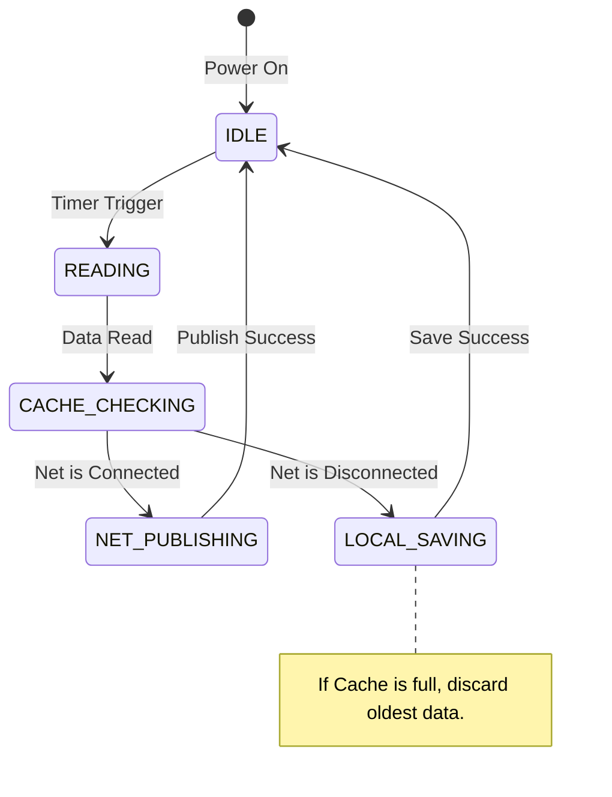

> When outsiders are all exclaiming "AI will replace programmers," the ones most fervently using AI and enjoying its efficiency dividends are, ironically, programmers themselves. This is a dark humor that only insiders understand — and a collective gamble on the future.

---

## Prologue: The Emptiness of Being Swept Along by Borrowed Power

If you've ever been like me, staying up late watching AI rapidly spit out perfect code on screen, what welled up inside might not have been excitement, but an indescribable **sense of emptiness**.
This feeling stems from a secret panic: **I have mastered a power that does not belong to me.**
That code was elegant, efficient, and even contained advanced algorithms I'd never heard of. I just had to copy, paste, compile, and the project ran. But did I really learn it? No. I was merely a "feature porter." This <strong>struggle of "only knowing how to write code with AI"</strong> haunts every embedded engineer rushing through projects like a ghost.
We face a dual dilemma:

1.  **The anxiety of tight deadlines**: To deliver project quality and quantity, we have no time to carefully digest the cutting-edge content AI throws at us.
2.  **The emptiness of growth**: The project was delivered, but my experience points didn't seem to grow proportionally.

However, research data gives us a starkly different perspective. Those who can **use AI in a disciplined manner, leveraging it to improve efficiency and solve tedious, repetitive work** hold the most optimistic attitudes toward their future career planning and prospects.
Why? Because they've seen through a truth: <strong>AI is not here to steal the fruits of your labor — it's the jaw that helps you gnaw through the "tough bones."</strong> With or without AI, those technical hurdles you've never tackled, those complex system architectures — they all must be overcome. The difference now is: do you choose to gnaw at them with your bare teeth, or do you learn to forge and wield a sharp <strong>"dragon-slaying blade"</strong>.

This article is a record of how I emerged from that emptiness, attempting to find a path to <strong>internalize "borrowed power" as "intrinsic capability"</strong>.

---

## I. Value Reconstruction: The Truth Beneath the Iceberg

### 1. Escaping the "Trap of Diligence"

Many beginners (and even some experienced developers) easily fall into a trap: becoming addicted to the sense of accomplishment from "hand-coding." They feel that only what they've typed line by line counts as "having learned it." Little do they know, this is often a case of <strong>"using tactical diligence to mask strategic laziness"</strong>.

The reality is brutal: **99% of problems have already been solved by predecessors.** Writing an I2C driver? The chip vendor's HAL library has the standard answer. Writing a ring buffer? The Linux kernel implementation is textbook-level.
If you don't study the achievements of predecessors, the code you spend three days writing is often full of bugs, unhandled edge cases, and poor efficiency. You hand-crafted a square, airless wheel, while AI directly gave you a Ferrari wheel. **Not only is it inefficient, but you also never learned why the Ferrari goes fast.**

> [!WARNING]
> Being addicted to "hand-coding" is a manifestation of **tactical diligence, strategic laziness**. 99% of problems have already been solved by predecessors; not learning from their results and instead reinventing the wheel from scratch — and a square one at that.

### 2. The Depreciation of Code Implementation and the Appreciation of Thinking

In the AI era, the value system has undergone a dramatic tectonic shift:

| Layer | Content | Current Status |
| --- | --- | --- |
| **Above the Surface (Functional Code)** | Button logic, UI navigation, simple protocol send/receive | Value approaches zero — AI dominates this domain |
| **Below the Surface (Core Assets)** | Core algorithms, system architecture, security, robustness | Value infinitely amplified — the watershed between "toys" and "industrial products" |

**Work places more emphasis on project engineering experience, and this is precisely why.** Because experience represents how many pitfalls you've encountered. Books teach you how to write code, but experience teaches you how to handle exceptions. For example, what do you do when I2C communication hangs under interference? How do you recover data when power fails mid-Flash-erase? These "bloody" lessons and trade-off decisions based on physical constraints are what AI struggles to auto-generate.

> [!QUESTION]
> **Will AI replace programmers?**
>
> This is a false proposition. AI replaces "code monkeys" — those who rely solely on mature business logic, type code manually, and never think about architecture. For those who know how to leverage AI to unleash productivity and innovate standing on the shoulders of giants, AI is an amplifier. **Outsiders see the noise and feel crisis everywhere; insiders see the craft and are riding high.** It's precisely those who can use AI in a disciplined way and automate tedious work who are the most optimistic about their career prospects.

---

## II. A New Interpretation of Project Experience: From "Implementer" to "Manager"

On resumes or in interviews, we often see project descriptions. In the AI era, we need to re-examine: **what did we actually gain from a project?**
On the surface, it might just be "experience of having AI implement related features and getting them to work." But this is merely the surface. The true deep value lies in the evolution of the role you played in the project.

### 1. Beware of Being a "Feature Porter"

If you merely treat the project as "having AI write code, and then it ran," your experience is fragile. Because once the chip changes, once the protocol changes, the code AI generates changes too, and your "experience of getting it to work" may become invalid. This kind of experience is essentially just "experience of trying an AI tool," not "engineering experience."
This is the source of that **sense of emptiness** — you delivered code, but you didn't deliver your own growth.

> [!CAUTION]
> The experience of "having AI write code and then getting it to work" is fragile. Change the chip, change the protocol, and your "debugging experience" may fail. This is essentially "experience of trying an AI tool," not "engineering experience."

### 2. The True Essence of Project Experience: Decision-Making and Control

A high-quality AI-assisted project actually proves you possess the following capabilities:

- **Requirement translation capability**: You can transform a vague requirement like "I want a temperature and humidity monitoring system" into an AI-executable <strong>constraint package</strong> like "STM32F407 + 2000ms period + MQTT protocol + static memory allocation."
- **Architecture governance capability**: You don't just have AI write code — you also lock down AI's design direction through **engineering artifacts (module diagrams, state machines)**, ensuring clear code structure and decoupled modules.
- **Tough bone gnawing capability**: For technical difficulties you've never tackled (regardless of the method), you must gnaw through them. AI helps you search for information and propose solutions, but **making the final decision** and **physical verification** (checking waveforms with an oscilloscope, checking memory with map files) must be done by you.

> [!IMPORTANT]
> Project experience is not about whether the code was typed by you or by AI — it's about **what rules you defined** and **how you verified the validity of those rules in the physical world**. When you start focusing on these things, the sense of emptiness will be replaced by a sense of mastery.

---

## III. Methodology Upgrade: How to Efficiently Use AI to Solve Embedded Problems

The uniqueness of embedded development lies in **hardware physical constraints** (timing, memory, power consumption). AI is a genius, but it doesn't understand physics, and it doesn't understand your board. Therefore, we need a "human-centric, AI-as-accelerator" methodology. This not only improves efficiency but also ensures that within limited time, we truly digest that "cutting-edge" content.

### 1. Core Strategy: Context Engineering

The biggest taboo in embedded development is "air-to-air" communication. The root cause of AI writing unusable code is the lack of hardware environment context.

| Usage Level | Example | Result |
| --- | --- | --- |
| **Beginner** | "Help me write code to read MPU6050" | Gives you standard Linux I2C code that freezes immediately on STM32 |
| **Advanced** | Provide complete context (see below) | Generates usable code with error handling |

**Advanced usage (providing context) example**:

> "I'm using STM32F407VET6, developing based on the HAL library. The I2C interface is I2C1, with SCL/SDA pins PB6/PB7. Clock frequency is configured at 84MHz. Please help me write a function to read the MPU6050 WHO_AM_I register, including error handling and timeout mechanism (Timeout=100ms), using blocking mode, and conforming to MISRA C standards."

> [!TIP]
> The more precise the context, the more reliable the AI output. In embedded scenarios, **chip model, peripheral interface, pin configuration, clock frequency, and constraint conditions** are all indispensable. It's like giving an intern a complete spec — only then can they deliver qualified work.

### 2. Decision Assistance: Using AI for "Brainstorming"

Before writing code, use AI to close information gaps and assist with architectural decisions. This reflects "architect" thinking.

- **Scenario A: Technology Selection**
  - _Question_: "I need to implement a simple file system on a resource-constrained STM32F103 to log data. FatFS is too big — how about LittleFS? Or do you have any lighter suggestions? Please compare their wear-leveling algorithms and RAM usage."
- **Scenario B: Architecture Design**
  - _Question_: "I have a sampling interrupt (1kHz) and a UART send task. To prevent packet loss, should I use a message queue or a ring buffer? Please give pseudocode comparisons for both approaches and analyze their behavior under high load."

### 3. Pitfall Avoidance Guide: Using AI for "Red Team Testing"

Rather than having AI write code, have it **review your code**. This is a shortcut to improving robustness, and it's using AI as a "senior mentor."

- **Static Analysis**: Paste your C code to AI.
  - _Instruction_: "Please check this code for potential memory leaks, array out-of-bounds, deadlock risks, or integer overflows? Focus on pointer usage and interrupt safety."
- **Code Optimization**:
  - _Instruction_: "This function runs too slowly on my 72MHz MCU. Can you help me check if it can be optimized using lookup tables, bit manipulation, or reducing division operations?"

### 4. Critical "Red Lines": Where Must Humans Intervene?

Although AI is powerful, in the embedded domain, the following three aspects **must be personally controlled by you**, or disaster ensues:

1.  **Timing and Physical World Verification**: AI doesn't understand "electricity." The I2C timing AI writes might not account for slowed rising edges caused by capacitance. <strong>You must check waveforms with an oscilloscope/logic analyzer.</strong>
2.  **Resource Usage Control**: AI doesn't understand "poverty." For code elegance, it might allocate large arrays or use `printf`. <strong>You must check `.map` files to verify RAM/Flash usage.</strong>
3.  **Safety Net**: AI doesn't understand "malice." The parsing function AI writes might not validate data length. <strong>You must personally do Code Reviews and check boundary protection.</strong>

> [!CAUTION]
> Three inviolable red lines in embedded development:
>
> 1. **Timing Verification** — AI doesn't understand "electricity"; you must check waveforms with an oscilloscope
> 2. **Resource Control** — AI doesn't understand "poverty"; you must check `.map` files
> 3. **Safety Net** — AI doesn't understand "malice"; you must personally do Code Reviews

### 5. The "Achilles' Heel" of Embedded AI: Current Status and Limitations

We must soberly recognize that AI at its current stage is **not omnipotent** in embedded development — it even has quite obvious shortcomings. This is not to deny AI's value, but to use it more rationally. These limitations are mainly reflected in:

- **Domain Knowledge Scarcity and Insufficient Training Data**: General large models have relatively little training data in the embedded domain, especially deep-level information for specific chips and peripherals. This leads to AI having **incomplete knowledge of hardware and chip specifics**, and may even **fabricate fake APIs**. For example, it might confidently recommend a register or library function that doesn't exist at all, causing you to hit a wall at compile time, or exhibiting unpredictable behavior at runtime.

- <strong>The "Hallucination" Problem and Factual Errors</strong>: AI can speak nonsense with a straight face. It might generate seemingly reasonable but actually incorrect circuit connection suggestions, or give misleading information about a chip's electrical characteristics (such as maximum drive capability, power consumption curves). This <strong>correctness-not-guaranteed</strong> characteristic is especially dangerous when it involves hardware design and circuit crossover, potentially <strong>causing obstacles in hardware design where actual crossovers occur</strong>, or even damaging hardware.

- **Lack of Physical World Perception**: AI doesn't understand "heat," "noise," or "electromagnetic interference" — these physical realities. It can't tell you whether a long high-frequency signal trace will introduce crosstalk, or whether a power supply filtering scheme will be stable at low temperatures. All of these require engineers' experience and physical world verification.

- **Context Window and Project Scale Limitations**: For large embedded projects, AI's context window may not accommodate the entire codebase and documentation, causing it to deviate when understanding global architecture and module dependencies. It excels at handling local, modular tasks but struggles with complex cross-file, cross-module interactions.

> [!NOTE]
> This is precisely why the industry is investing heavily in **building high-quality domain knowledge bases (RAG)**, **implementing verification loops based on real tool feedback**, and **tackling register-level fact verification and citation tracing** to reduce these "hallucinations" and make AI output more reliable. But this also tells us: <strong>at the current stage, AI is more like an "intern" who needs strict guidance and verification, not an "expert" you can fully rely on</strong>. Our role has shifted from "the person who writes code" to "the architect and quality gatekeeper who defines problems, designs boundaries, and verifies results."

---

## IV. Engineering Artifact-ization: Turning Design into AI-Executable Input

Requirements packages alone aren't enough — design logic is implicit. We need to transform the designs in our minds into **explicit engineering artifacts** to lock down AI's thinking boundaries and prevent it from going off-topic (producing hallucinations). This isn't just a method to improve code quality — it's a process of **forcing yourself to think deeply**.

> [!QUESTION]
> **Why must you draw diagrams?**
>
> Because AI has "hallucinations." If you don't give it a map (module diagram), it might draw a circular square. Artifact-ization forces AI to work within the framework you set, ensuring the generated code architecture is controllable. At the same time, when you can draw what's in your mind, that "hollow anxiety" disappears.

### 1. Core Engineering Artifacts

You need to learn to create (using Mermaid or text descriptions) the following artifacts:

- **Module Diagram**: Clarify who calls whom, delineate boundaries.
- **Interface Table**: Clarify function signatures, input and output parameters.
- **State Machine**: Clarify state transition logic, prevent if-else chaos.
- **Sequence Diagram**: Clarify ordering and timing constraints.

### 2. Practice: Artifact-izing "Disconnect-Reconnect and Data Caching" Logic

If you want AI to help you implement complex logic, first show it **design artifacts**.
**Prompt Example (Artifact Input):**

````markdown
# Design Artifacts for Implementation

Based on the above requirements, I have completed the architectural design. Please strictly follow the artifacts below for code implementation:

## 1. Module Architecture

Please implement the following three modules:

- `SensorMgr`: Responsible for low-level AHT10 driver and data reading.
- `DataCache`: Responsible for local data caching (FIFO) during network disconnection.
- `NetMgr`: Responsible for MQTT sending and network status management.

## 2. Interface Definition

Please strictly follow the interface signatures below — do not modify:

```c
int sensor_read(sensor_data_t *data);
void cache_push(const sensor_data_t *data);
int cache_pop(sensor_data_t *data);
net_state_t net_get_status(void);
```
````

## 3. State Machine (Business Logic State Machine)

The main thread logic must strictly follow the state machine transitions below:



---

## V. Capability Precipitation: The Leap from Prompt to Skill

When building GPTs or custom Agents, **Prompt** and **Skill** are concepts at two different levels. This is a crucial step toward saying goodbye to emptiness and building a personal moat.

| Dimension | **Prompt** | **Skill** |
| :--- | :--- | :--- |
| **Essence** | Temporary instruction | Precipitated asset |
| **Reusability** | Low — needs modification and resending each time | High — once encapsulated, only parameters need passing |
| **Complexity** | Suitable for single, linear tasks | Suitable for multi-step, complex, workflow-based tasks |
| **Your Role** | Operator (personally directing) | Architect (setting rules for automatic execution) |

### 1. What Kind of Actions Are Suitable for Precipitation into Skills?

- **High-frequency reuse**: Parsing serial data packets, writing unit test frameworks.
- **Deterministic logic**: Fixed procedures for initializing peripherals.
- **Experience-dependent**: Tasks where beginners easily make mistakes, with clear pitfall-avoidance guides (e.g., memory safety checks).

### 2. Practice: Building the `Embedded_Protocol_Parser_Generator` Skill

We'll solidify the experience of "robust serial parsing." This is the most frequent and painful scenario in embedded development.

**Experience Precipitation (written into the Skill's rule base):**

1.  Serial communication is stream-based; it must be processed with a state machine.
2.  Never trust the Length field; always verify it doesn't exceed Buffer size.
3.  Must handle sticky packets / partial packets.
4.  `malloc` is prohibited.

**Skill Structure:**

- **Input Definition**:
  - `Frame_Format`: Frame structure definition.
  - `Header_Value`: Specific hex value of the frame header.
  - `Max_Buffer_Size`: Maximum bytes for the receive buffer.
- **Core Logic Rules (System Prompt section)**:

  ```markdown
  # Rules of Experience

  1. **State Machine Design**: Must include WAIT_HEADER, WAIT_LENGTH, WAIT_DATA, WAIT_CRC, READY states.
  2. **Safety Defense**: In WAIT_LENGTH state, if Length > Max_Buffer_Size, must jump directly to WAIT_HEADER and discard data.
  3. **Handle Sticky/Partial Packets**: The parsing function must support stream processing of "one byte at a time."
  4. **Memory Strategy**: Use static arrays; malloc is strictly prohibited.
  ```

**Execution Result:**
Next time, just input: "Header=`0xAA55`, CRC=`CRC8`, Buffer=`128`".
AI will automatically generate C code with state machine, overflow protection, and stream processing. **This is transforming personal capability into organizational assets.**

> [!TIP]
> The core value of Skills: **turning personal capability into organizational assets**. Precipitate once, reuse forever. Next time, just pass in the parameters, and AI will automatically generate code that conforms to your experience-based rules.

---

## VI. Growth Path: Four Stages from "Roadside" to "Master"

Based on the depth of AI usage, four stages can be defined. These are the criteria for judging whether an engineer is "AI-native," and the advancement ladder for you to escape emptiness:

### 1. Essentially Roadside (Novice/Dabbler)

- **Behavior**: Only uses free web-based AI (like ChatGPT web), asking questions in plain language ("Help me write a sort").
- **Characteristics**: No context, no private data, solves extremely simple generic problems.
- **Assessment**: This is "consuming AI." It's like randomly grabbing someone on the street for directions — pure luck.

### 2. Essentially Not a Master (Junior Engineer)

- **Behavior**: Knows context is needed, copies and pastes files from the codebase to AI, but still operates on the web.
- **Characteristics**: Has context awareness, but delivery efficiency is extremely low, limited by character limits, unable to cover the entire project.
- **Assessment**: This is "being a porter." You understand the importance of "ingredients," but your "kitchen tools" (the web interface) are too primitive.

### 3. Essentially Not Roadside (Professional Engineer/User)

- **Behavior**: Uses AI-integrated environments (like Cursor, Windsurf, VSCode + Copilot), directly adding workspaces.
- **Characteristics**: Tools are in place, can improve daily efficiency. But lacks management thinking, directly throwing the entire workspace at AI causes too much noise.
- **Assessment**: You've left the "roadside stall" and entered the regular army ranks — you're a "skilled worker."

### 4. Essentially a Master (AI Architect/Top Player)

- **Behavior**: **Not just using AI, but managing AI.**
  - **Managing MD Engineering**: Writes structured Prompt templates and technical documents as AI's knowledge base.
  - **Branch Configuration Optimization**: Uses Git branches to manage different versions of context, preventing old code from interfering with new logic.
  - **Optimizing Retrieval Efficiency**: Filters out noise like `build`, `node_modules` through configurations like `.cursorignore`, keeping AI focused on core code.
  - **Precipitating Skills**: Writes Debug experience and design patterns into custom instructions or Agents.
- **Assessment**: You're no longer using AI to solve problems — you've <strong>built an "AI-based automated R&D system"</strong>. You've created an AI assistant that obeys you. At this point, you'll never feel empty again, because every Skill you precipitate is a solid brick in your capability moat.

> [!QUESTION]
> **Why do masters need to manage MD and branch configurations?**
>
> Because in large-scale engineering, context is money. Invalid noise dilutes AI's attention. Masters achieve precise control over AI's thinking process through fine-grained management (MD documents as structured knowledge, branches as isolated environments) — this is the essential leap from "using tools" to "mastering tools."

---

## VII. Epilogue: Redefining Yourself Amidst the Tide

Returning to the original question: **what did we actually gain from a project?**

If you just had AI write code for you, what you gained is a runnable binary file and an empty resume.
But if you follow the methodology above — defining constraints, creating artifacts, precipitating Skills, managing context — then what you gain is:

- <strong>From "Implementer" to "Decision-Maker"</strong>: No longer fixating on specific syntax implementation, but focusing on technology selection, architectural design, and resource trade-offs.
- <strong>From "Lone Warrior" to "System Integrator"</strong>: Using AI to break through full-stack barriers, becoming a super-individual capable of solving complex system problems.
- <strong>From "Experience Accumulation" to "Knowledge Precipitation"</strong>: Transforming personal experience into reusable Skills, building your own automated R&D system.

<strong>AI is not the terminator of programmers — it is the "filter of the mediocre" and the "amplifier of the elite."</strong>

Those who use AI in a disciplined way are optimistic not because they depend on AI, but because through AI, they've found a more advanced way of surviving. **No matter how tough the bones are, we now have sharper jaws; no matter how tight the deadlines, we now have more efficient engines.**

But at the same time, we must remain constantly clear-headed: **AI, especially in fields like embedded systems, is far from perfect.** It has its "Achilles' heel" — scarcity of domain knowledge, unavoidable "hallucinations," and absence of physical world perception. These all require us to compensate, master, and transcend with deep engineering experience, rigorous verification processes, and a never-ending spirit of skepticism.

> [!IMPORTANT]
> **Our value lies precisely in being able to see through AI's limitations and organize all resources (including AI itself) to overcome those limitations, ultimately delivering a reliable, robust system that can operate in the real world for the long term.**

As long as you can grasp the essence of engineering thinking, master advanced methods of collaborating with AI, and maintain reverence for the physical world and clear awareness of technological boundaries, that sense of emptiness from "mastering power that doesn't belong to you" will eventually dissipate — replaced by **absolute mastery** over technology and the future.
