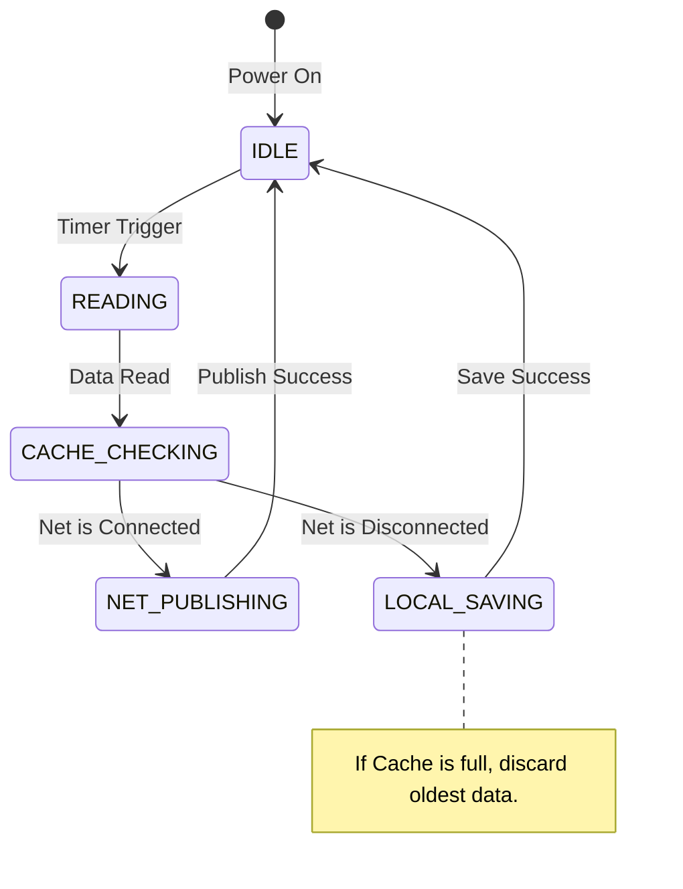

> 当外行都在惊呼"AI 将取代程序员"时，最狂热地使用 AI、享受 AI 带来的效率红利的，恰恰正是程序员自己。这是一种只有内行才懂的黑色幽默，也是对未来的一场集体豪赌。

---

## 前言：被借来的力量裹挟的空虚感

如果你曾像我一样，在一个深夜看着 AI 屏幕上飞速吐出的完美代码，心里涌起的可能不是兴奋，而是一种难以名状的**空虚感**。
这种感觉源于一种隐秘的恐慌：**我掌握了不属于我的力量。**
那些代码优雅、高效、甚至包含了我未曾听闻的高级算法。我只需复制、粘贴、编译，项目就跑通了。但我真的学会了吗？没有。我只是一个"功能搬运工"。这种<strong>"只会用 AI 写代码"的困扰</strong>，像幽灵一样缠绕着每一个赶项目的嵌入式人。
我们面临着双重困境：

1.  **时间紧迫的焦虑**：为了追求项目的交付质量和数量，我们没有时间去细细消化 AI 抛给我们的那些超前的内容。
2.  **成长的空虚**：项目交付了，但我的经验值似乎并没有按比例增长。

然而，研究数据给了我们一个截然不同的视角。那些能够**规范使用 AI、将其用于提升效率和解决繁琐重复工作**的人，对未来的职业规划和前景持有最乐观的态度。
为什么？因为他们看透了一个真相：<strong>AI 不是来剥夺你劳动成果的对手，而是帮你啃下那些"硬骨头"的牙口。</strong> 无论有没有 AI，那些没搞过的技术难关、那些复杂的系统架构，都必须跨过去。而现在的区别在于，你是选择用牙齿硬啃，还是学会制造并驾驭一把锋利的<strong>"屠龙刀"</strong>。

这篇文章，就是为了记录我如何从这种空虚感中走出，试图寻找一条<strong>将"借来的力量"内化为"自身能力"</strong>的道路。

---

## 一、价值重构：冰山下的真相

### 1. 摆脱"勤奋的陷阱"

很多初学者（甚至包括一些有经验的开发者）容易掉进一个陷阱：沉迷于"手搓代码"的成就感。他们觉得只有自己一行行敲出来的，才叫"学会了"。殊不知，这往往是<strong>"用战术上的勤奋，掩盖战略上的懒惰"</strong>。

现实是残酷的：**99% 的问题前人都已经解决过了。** 写一个 I2C 驱动？芯片厂商的 HAL 库里就是标准答案。写一个环形缓冲区？Linux 内核里的实现是教科书级别的。
如果你不去研究前人的成果，你花了三天写出来的代码往往充满 Bug、边界条件没处理、效率低下。你手搓了一个方形且没气的轮子，而 AI 直接给了你一个法拉利的轮子。**不仅效率低，而且你还没学会法拉利为什么跑得快。**

> [!WARNING]
> 沉迷"手搓代码"是一种**战术勤奋、战略懒惰**的表现。99% 的问题前人已解决，不去学习前人成果，反而从零造轮子，造出来的还是方的。

### 2. 代码实现的贬值与思维的升值

在 AI 时代，价值体系发生了剧烈的地壳运动：

| 层次                     | 内容                               | 现状                                          |
| ------------------------ | ---------------------------------- | --------------------------------------------- |
| **海面之上（功能代码）** | 按键逻辑、界面跳转、简单的协议收发 | 价值无限趋近于零 — AI 秒杀的领域              |
| **海面之下（核心资产）** | 核心算法、系统架构、安全性、鲁棒性 | 价值无限放大 — 区分"玩具"与"工业产品"的分水岭 |

**工作更看重项目工程经历与经验，原因就在于此。** 因为经验代表了你踩过多少坑。书本教你如何写代码，但经验教你如何处理异常。比如，I2C 通信在干扰下挂死怎么办？Flash 擦除中途断电如何恢复数据？这些"血淋淋"的教训和基于物理约束的权衡决策，是 AI 难以自动生成的。

> [!QUESTION]
> **AI 会取代程序员吗？**
>
> 这是一个伪命题。AI 取代的是"码农"——那些只靠成熟业务逻辑、靠人力敲代码、不思考架构的人。而对于懂得利用 AI 释放生产力、站在巨人肩膀上进行创新的人来说，AI 是放大器。**外行看热闹，觉得危机四伏；内行看门道，正用得爽翻天。** 恰恰是那些能够规范使用 AI、把繁琐工作自动化的人，对未来的职业前景最为乐观。

---

## 二、项目经验的新解：从"实现者"到"管理者"

在简历或面试中，我们常看到一个项目描述。在 AI 时代，我们需要重新审视：**从一个项目中，我们究竟得到了什么？**
表面上看，可能只是"提供 AI 实现了相关的功能与调通的经验"。但这只是表象。真正的深层价值，在于你在这个项目中扮演的角色演变。

### 1. 警惕"功能搬运工"

如果你仅仅把项目当作"让 AI 写代码，然后跑通了"，那么你的经验是脆弱的。因为一旦换了芯片、换了协议，AI 生成的代码变了，你的"调通经验"可能就失效了。这种经验本质上只是"试用 AI 工具的经验"，而不是"工程经验"。
这就是那种**空虚感的来源**——你交付了代码，却没有交付自己的成长。

> [!CAUTION]
> "让 AI 写代码然后跑通"的经验是脆弱的。换了芯片、换了协议，你的"调通经验"就可能失效。这本质上是"试用 AI 工具的经验"，而非"工程经验"。

### 2. 项目经验的真谛：决策与控制

一个高质量的 AI 辅助项目，实际上证明了你具备以下能力：

- **需求转化的能力**：你能将"我要一个温湿度监测系统"这样模糊的需求，转化为"STM32F407 + 2000ms 周期 + MQTT 协议 + 静态内存分配"这样 AI 可执行的<strong>约束包</strong>。
- **架构管控的能力**：你不仅让 AI 写了代码，还通过**工程工件（模块图、状态机）** 锁定了 AI 的设计方向，确保代码结构清晰、模块解耦。
- **啃硬骨头的能力**：对于没搞过的技术难点（不管用什么方式），你必须啃过去。AI 帮你查资料、出方案，但**拍板决策**和**物理验证**（示波器看波形、map 文件看内存）必须是你。

> [!IMPORTANT]
> 项目经验不在于代码是你敲的还是 AI 敲的，而在于**你定义了什么样的规则**，以及**你如何验证这些规则在物理世界中的有效性**。当你开始关注这些，空虚感就会被掌控感取代。

---

## 三、方法论升级：如何高效使用 AI 解决嵌入式问题

嵌入式开发的特殊性在于**硬件物理约束**（时序、内存、功耗）。AI 是个天才，但它不懂物理，也不懂你的板子。因此，我们需要一套"以人为核心，AI 为加速器"的方法论。这不仅能提高效率，更是为了在有限的时间内，真正消化那些"超前"的内容。

### 1. 核心策略：上下文工程

嵌入式最忌讳"空对空"。AI 写出不可用代码的根源在于缺乏硬件环境上下文。

| 用法层级 | 示例                            | 结果                                                 |
| -------- | ------------------------------- | ---------------------------------------------------- |
| **初级** | "帮我写一个读取 MPU6050 的代码" | 给你一段标准的 Linux I2C 代码，用到 STM32 上直接卡死 |
| **高级** | 提供完整上下文（见下方）        | 生成可用的、包含错误处理的代码                       |

**高级用法（提供上下文）示例**：

> "我正在使用 STM32F407VET6，基于 HAL 库开发。I2C 接口是 I2C1，对应的 SCL/SDA 引脚是 PB6/PB7。时钟频率配置为 84MHz。请帮我写一个读取 MPU6050 WHO_AM_I 寄存器的函数，要求包含错误处理和超时机制（Timeout=100ms），使用阻塞模式，并符合 MISRA C 规范。"

> [!TIP]
> 上下文越精确，AI 输出越可靠。嵌入式场景下，**芯片型号、外设接口、引脚配置、时钟频率、约束条件**缺一不可。这就像给实习生一份完整的 spec，他才能交出合格的作业。

### 2. 决策辅助：用 AI 做"头脑风暴"

在动手写代码之前，利用 AI 扫除信息差，辅助你做架构决策。这是"架构师"思维的体现。

- **场景 A：技术选型**
  - _提问_："我需要在一个资源受限的 STM32F103 上实现一个简单的文件系统来记录日志。FatFS 太大了，LittleFS 怎么样？或者你有什么更轻量的建议？请对比它们的磨损均衡算法和 RAM 占用。"
- **场景 B：架构设计**
  - _提问_："我有一个采集中断（1kHz）和一个串口发送任务。为了防止丢包，我应该使用消息队列还是环形缓冲区？请给出两种方案的伪代码对比，并分析在高负载下的表现。"

### 3. 避坑指南：让 AI 做"红队测试"

与其让 AI 写代码，不如让它**审查你的代码**。这是提升鲁棒性的捷径，也是把 AI 当作"资深导师"的用法。

- **静态分析**：把你的 C 代码贴给 AI。
  - _指令_："请检查这段代码是否存在内存泄漏、数组越界、死锁风险或整数溢出的可能？重点关注指针的使用和中断安全。"
- **代码优化**：
  - _指令_："这段函数在我的 72MHz MCU 上运行耗时太长了，请帮我查看是否可以通过查表法、位操作或减少除法运算来优化它？"

### 4. 关键的"红线"：人必须在哪里介入？

虽然 AI 很强，但在嵌入式领域，以下三个环节**必须由你亲自把控**，否则就是灾难：

1.  **时序与物理世界的校验**：AI 不懂"电"。AI 写的 I2C 时序可能没有考虑电容导致的上升沿变缓。<strong>必须拿示波器/逻辑分析仪看波形。</strong>
2.  **资源占用的把控**：AI 不懂"穷"。它为了代码优雅，可能会申请大数组或使用 `printf`。<strong>必须看 `.map` 文件，检查 RAM/Flash 占用。</strong>
3.  **安全性兜底**：AI 不懂"恶意"。AI 写的解析函数可能没有对数据长度做校验。<strong>必须亲自做 Code Review，检查边界保护。</strong>

> [!CAUTION]
> 嵌入式领域三条不可逾越的红线：
>
> 1. **时序校验** — AI 不懂"电"，必须拿示波器看波形
> 2. **资源把控** — AI 不懂"穷"，必须看 `.map` 文件
> 3. **安全兜底** — AI 不懂"恶意"，必须亲自 Code Review

### 5. 嵌入式 AI 的"阿喀琉斯之踵"：现状与局限

我们必须清醒地认识到，当前阶段的 AI 在嵌入式开发中**并非全能**，甚至存在相当明显的短板。这不是否定 AI 的价值，而是为了更理性地使用它。这些局限主要体现在：

- **领域知识匮乏与训练数据不足**：通用大模型在嵌入式领域的训练数据相对较少，尤其是针对特定芯片、特定外设的深层次信息。这导致 AI 对**硬件、芯片的具体信息掌握不全**，甚至会出现**编造虚假 API** 的情况。例如，它可能会自信地推荐一个根本不存在的寄存器或库函数，让你在编译阶段就碰壁，或者在运行时出现不可预测的行为。

- <strong>"幻觉"问题与事实性错误</strong>：AI 会一本正经地胡说八道。它可能会生成看似合理实则错误的电路连接建议，或者对芯片的电气特性（如最大驱动能力、功耗曲线）给出误导性信息。这种<strong>正确性不能保证</strong>的特性，在涉及硬件设计、电路交叉的部分时尤其危险，可能导致<strong>设计硬件实际交叉的部分遇到阻碍</strong>，甚至损坏硬件。

- **物理世界感知的缺失**：AI 不懂"热"、"噪声"、"电磁干扰"这些物理现实。它无法告诉你，某个高频信号走线过长会不会引入串扰，或者某个电源滤波方案在低温下是否稳定。这些都需要工程师的经验和物理世界的验证。

- **上下文窗口与项目规模的限制**：对于大型嵌入式项目，AI 的上下文窗口可能无法容纳整个代码库和文档，导致它在理解全局架构、模块依赖时出现偏差。它擅长处理局部、模块化的任务，但在处理跨文件、跨模块的复杂交互时显得力不从心。

> [!NOTE]
> 正因如此，行业正在投入大量资源，通过**构建高质量的领域知识库（RAG）**、**实现基于真实工具反馈的验证闭环**、**攻关寄存器级的事实校验与引用溯源**等方式，来努力减少这些"幻觉"，让 AI 的输出更加可靠。但这同时也告诉我们：<strong>在当前的阶段，AI 更像是一个需要被严格引导和验证的"实习生"，而不是一个可以完全依赖的"专家"</strong>。我们的角色，从"写代码的人"，转变为了"定义问题、设计边界、验证结果"的"架构师"和"质量把关人"。

---

## 四、工程工件化：把设计变成 AI 可执行输入

光有需求包还不够，设计逻辑是隐性的。我们需要把脑海里的设计转化为**显性的工程工件**，以锁定 AI 的思考边界，防止它跑题（产生幻觉）。这不仅是提升代码质量的方法，更是**强制自己进行深度思考**的过程。

> [!QUESTION]
> **为什么一定要画图？**
>
> 因为 AI 有"幻觉"。如果你不给它一张地图（模块图），它可能会画出一个圆形的方块。工件化就是强制 AI 在你设定的框架内工作，确保生成的代码架构是可控的。同时，当你能把脑海里的图画出来时，那些"空洞的焦虑"也就消失了。

### 1. 核心工程工件

你需要学会绘制（用 Mermaid 或文字描述）以下工件：

- **模块图**：明确谁调用谁，划分边界。
- **接口表**：明确函数签名、入参出参。
- **状态机**：明确状态的流转逻辑，防止 if-else 混乱。
- **时序图**：明确先后顺序和耗时约束。

### 2. 实战：将"断网重连与数据缓存"逻辑工件化

如果你想让 AI 帮你实现复杂的逻辑，先给它看**设计工件**。
**Prompt 示例（工件化输入）：**

````markdown
# Design Artifacts for Implementation

基于上述需求，我已完成架构设计，请严格按照以下工件进行代码实现：

## 1. Module Architecture (模块划分)

请实现以下三个模块：

- `SensorMgr`: 负责底层 AHT10 驱动与数据读取。
- `DataCache`: 负责断网时的数据本地缓存（FIFO）。
- `NetMgr`: 负责 MQTT 发送与网络状态管理。

## 2. Interface Definition (接口定义)

请严格遵守以下接口签名，不得修改：

```c
int sensor_read(sensor_data_t *data);
void cache_push(const sensor_data_t *data);
int cache_pop(sensor_data_t *data);
net_state_t net_get_status(void);
```
````

## 3. State Machine (业务逻辑状态机)

主线程逻辑必须严格遵循以下状态机流转：



---

## 五、能力沉淀：从 Prompt 到 Skill 的跨越

在构建 GPTs 或自定义 Agent 时，**Prompt（提示词）**和 **Skill（技能/能力）**是两个不同层级的概念。这是告别空虚感、构建个人护城河的关键一步。

| 维度         | **Prompt (提示词)** | **Skill (技能/技能包)**        |
| :----------- | :------------------ | :----------------------------- |
| **本质**     | 临时的指令          | 沉淀的资产                     |
| **复用性**   | 低，每次需修改发送  | 高，封装好后只需传参数         |
| **复杂度**   | 适合单次、线性任务  | 适合多步、复杂、有工作流的任务 |
| **你的角色** | 操作员（亲自指挥）  | 架构师（制定规则自动执行）     |

### 1. 什么样的动作适合沉淀成 Skill？

- **高频复用**：解析串口数据包、编写单元测试框架。
- **逻辑确定**：初始化外设的固定流程。
- **依赖经验**：新手容易做错、有明确避坑指南的任务（如内存安全检查）。

### 2. 实战：构建 `Embedded_Protocol_Parser_Generator` Skill

我们将"鲁棒的串口解析"经验固化。这是一个嵌入式最高频、最痛点的场景。

**经验沉淀（写入 Skill 的规则库）：**

1.  串口是流传输，必须用状态机处理。
2.  永远不要相信 Length 字段，必须校验是否超过 Buffer 大小。
3.  必须处理粘包/半包。
4.  禁止使用 `malloc`。

**Skill 结构：**

- **输入定义**：
  - `Frame_Format`: 帧结构定义。
  - `Header_Value`: 帧头具体的十六进制值。
  - `Max_Buffer_Size`: 接收缓冲区的最大字节数。
- **核心逻辑规则（System Prompt 部分）**：

  ```markdown
  # Rules of Experience

  1. **状态机设计**：必须包含 WAIT_HEADER, WAIT_LENGTH, WAIT_DATA, WAIT_CRC, READY 状态。
  2. **安全防线**：在 WAIT_LENGTH 状态下，如果 Length > Max_Buffer_Size，必须直接跳转到 WAIT_HEADER 并丢弃数据。
  3. **处理粘包/半包**：解析函数必须支持"每次传入一个字节"的流式处理。
  4. **内存策略**：使用静态数组，严禁 malloc。
  ```

**运行结果：**
下次只需输入："Header=`0xAA55`, CRC=`CRC8`, Buffer=`128`"。
AI 就会自动生成包含状态机、溢出保护、流式处理的 C 代码。**这就是把个人能力变成了组织资产。**

> [!TIP]
> Skill 的核心价值：**把个人能力变成组织资产**。一次沉淀，终身复用。下次只需传入参数，AI 就能自动生成符合你经验规则的代码。

---

## 六、成长路径：从"路边"到"高手"的四个阶段

基于对 AI 使用的深度，可以划分四个阶段，这是判断一个工程师是否"AI 原生"的标准，也是你摆脱空虚感的进阶阶梯：

### 1. 本质路边（新手/玩票）

- **行为**：只在免费网页 AI（如 ChatGPT 网页版）上，用大白话提问（"帮我写个排序"）。
- **特征**：无上下文，无私有数据，解决极其简单的通用问题。
- **评价**：这叫"消费 AI"。就像你在路边随便抓个人问路，全看运气。

### 2. 本质不是高手（初级工程师）

- **行为**：知道需要上下文，会把代码库里的文件复制粘贴给 AI，但依然在网页上操作。
- **特征**：有上下文意识，但交付效率极低，受限于字数限制，无法覆盖整个工程。
- **评价**：这叫"搬运工"。你懂得了"料"的重要性，但你的"厨具"（网页）太简陋。

### 3. 本质不是路边（专业工程师/使用者）

- **行为**：使用 AI 集成环境（如 Cursor、Windsurf、VSCode + Copilot），直接添加工作区。
- **特征**：工具到位，能提升日常效率。但缺乏管理思维，直接把整个工作区丢给 AI 导致噪音太大。
- **评价**：你已经脱离了"路边摊"，进入了正规军序列，是"熟练工"。

### 4. 本质是高手（AI 架构师/顶级玩家）

- **行为**：**不仅用 AI，更在管理 AI。**
  - **管理 MD 工程**：编写结构化的 Prompt 模板、技术文档作为 AI 的知识库。
  - **分支配置优化**：利用 Git 分支管理不同版本的上下文，防止旧代码干扰新逻辑。
  - **优化检索效率**：通过 `.cursorignore` 等配置过滤 `build`、`node_modules` 等噪音，让 AI 聚焦核心代码。
  - **沉淀 Skill**：将 Debug 经验、设计模式写成自定义指令或 Agent。
- **评价**：你不再是用 AI 解决问题，而是<strong>搭建了一套"基于 AI 的自动化研发体系"</strong>。你造了一个听你话的 AI 助手。这时的你，再也不会感到空虚，因为每一个 Skill 的沉淀，都是实打实属于你的能力护城河。

> [!QUESTION]
> **为什么高手要管理 MD 和分支配置？**
>
> 因为在大型工程中，上下文就是金钱。无效的噪音会稀释 AI 的注意力。高手通过精细化管理（MD 文档作为结构化知识、分支作为隔离环境），实现了对 AI 思考过程的精准控制，这是从"使用工具"到"驾驭工具"的本质跨越。

---

## 七、结语：在浪潮中重新定义自我

回到最初的那个问题：**从一个项目中，我们究竟得到了什么？**

如果你只是让 AI 替你写了代码，你得到的是一个可以运行的二进制文件和一份空虚的履历。
但如果你按照上述的方法论，去定义约束、去绘制工件、去沉淀 Skill、去管理上下文，那么你得到的是：

- <strong>从"实现者"到"决策者"</strong>：不再纠结具体语法实现，而关注技术选型、架构设计和资源权衡。
- <strong>从"单兵作战"到"系统集成"</strong>：利用 AI 打通全栈壁垒，成为能解决复杂系统问题的超级个体。
- <strong>从"经验积累"到"知识沉淀"</strong>：将个人经验转化为可复用的 Skill，构建属于自己的自动化研发体系。

<strong>AI 不是程序员的终结者，它是"平庸者的过滤器"和"精英者的放大器"。</strong>

那些规范使用 AI 的人之所以乐观，不是因为他们依赖 AI，而是因为他们通过 AI，找到了一种更高级的生存方式。**不管硬骨头有多硬，我们都有了更锋利的牙口；不管时间有多紧迫，我们都有了更高效的引擎。**

但同时，我们也必须时刻清醒：**AI 尤其是在嵌入式这样的领域，远非完美**。它有它的"阿喀琉斯之踵"——领域知识的匮乏、难以避免的"幻觉"、物理世界感知的缺失。这些都需要我们用深厚的工程经验、严谨的验证流程和永不停止的怀疑精神去弥补、去驾驭、去超越。

> [!IMPORTANT]
> **我们的价值，恰恰在于能看穿 AI 的局限，并组织起一切资源（包括 AI 自身）来克服这些局限，最终交付一个可靠、鲁棒、能在现实世界中长期运行的系统。**

只要你能把握住工程思维的本质，掌握与 AI 协作的高级方法，同时保持对物理世界的敬畏和对技术边界的清醒认知，那种"掌握不属于自己力量"的空虚感终将消散，取而代之的，是对技术和未来的**绝对掌控**。
