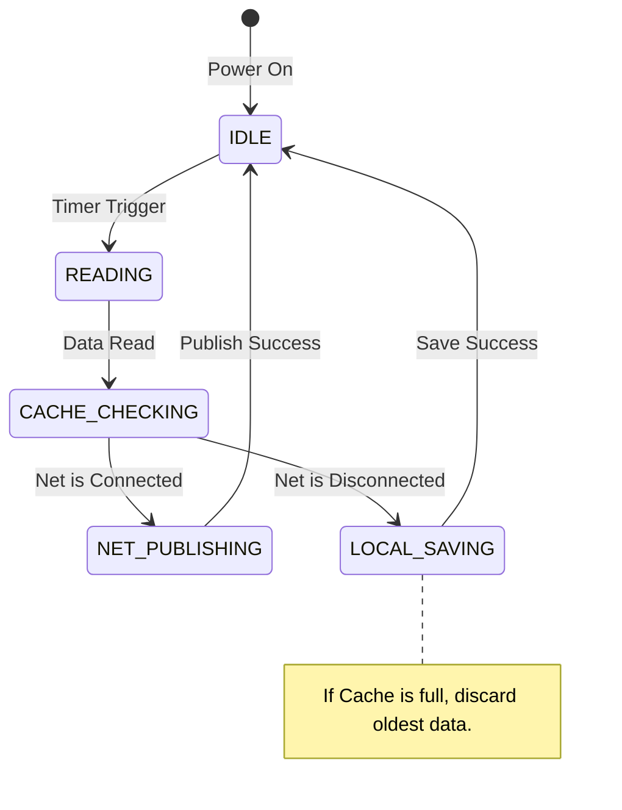

> 當外行都在驚呼「AI 將取代程式設計師」時，最狂熱地使用 AI、享受 AI 帶來的效率紅利的，恰恰正是程式設計師自己。這是一種只有內行才懂的黑色幽默，也是對未來的一場集體豪賭。

---

## 前言：被借來的力量裹挾的空虛感

如果你曾像我一樣，在一個深夜看著 AI 螢幕上飛速吐出的完美程式碼，心裡湧起的可能不是興奮，而是一種難以名狀的**空虛感**。
這種感覺源於一種隱秘的恐慌：**我掌握了不屬於我的力量。**
那些程式碼優雅、高效、甚至包含了我未曾聽聞的高級演算法。我只需複製、貼上、編譯，專案就跑通了。但我真的學會了嗎？沒有。我只是一個「功能搬運工」。這種<strong>「只會用 AI 寫程式碼」的困擾</strong>，像幽靈一樣纏繞著每一個趕專案的嵌入式人。
我們面臨著雙重困境：

1.  **時間緊迫的焦慮**：為了追求專案的交付品質和數量，我們沒有時間去細細消化 AI 丟給我們的那些超前的內容。
2.  **成長的空虛**：專案交付了，但我的經驗值似乎並沒有按比例增長。

然而，研究資料給了我們一個截然不同的視角。那些能夠**規範使用 AI、將其用於提升效率和解決繁瑣重複工作**的人，對未來的職業規劃和前景持有最樂觀的態度。
為什麼？因為他們看透了一個真相：<strong>AI 不是來剝奪你勞動成果的對手，而是幫你啃下那些「硬骨頭」的牙口。</strong> 無論有沒有 AI，那些沒搞過的技術難關、那些複雜的系統架構，都必須跨過去。而現在的區別在於，你是選擇用牙齒硬啃，還是學會製造並駕馭一把鋒利的<strong>「屠龍刀」</strong>。

這篇文章，就是為了記錄我如何從這種空虛感中走出，試尋找一條<strong>將「借來的力量」內化為「自身能力」</strong>的道路。

---

## 一、價值重構：冰山下的真相

### 1. 擺脫「勤奮的陷阱」

很多初學者（甚至包括一些有經驗的開發者）容易掉進一個陷阱：沉迷於「手搓程式碼」的成就感。他們覺得只有自己一行行敲出來的，才叫「學會了」。殊不知，這往往是<strong>「用戰術上的勤奮，掩蓋策略上的懶惰」</strong>。

現實是殘酷的：**99% 的問題前人都已經解決過了。** 寫一個 I2C 驅動？晶片廠商的 HAL 庫裡就是標準答案。寫一個環形緩衝區？Linux 核心裡的實作是教科書等級的。
如果你不去研究前人的成果，你花了三天寫出來的程式碼往往充滿 Bug、邊界條件沒處理、效率低下。你手搓了一個方形且沒氣的輪子，而 AI 直接給了你一個法拉利的輪子。**不僅效率低，而且你還沒學會法拉利為什麼跑得快。**

> [!WARNING]
> 沉迷「手搓程式碼」是一種**戰術勤奮、策略懶惰**的表現。99% 的問題前人已解決，不去學習前人成果，反而從零造輪子，造出來的還是方的。

### 2. 程式碼實作的貶值與思維的升值

在 AI 時代，價值體系發生了劇烈的地殼運動：

| 層次                     | 內容                               | 現狀                                          |
| ------------------------ | ---------------------------------- | --------------------------------------------- |
| **海面之上（功能程式碼）** | 按鍵邏輯、界面跳轉、簡單的協議收發 | 價值無限趨近於零 — AI 秒殺的領域              |
| **海面之下（核心資產）** | 核心演算法、系統架構、安全性、魯棒性 | 價值無限放大 — 區分「玩具」與「工業產品」的分水嶺 |

**工作更看重專案工程經歷與經驗，原因就在於此。** 因為經驗代表了你踩過多少坑。書本教你如何寫程式碼，但經驗教你如何處理異常。比如，I2C 通訊在干擾下掛死怎麼辦？Flash 擦除中途斷電如何恢復資料？這些「血淋淋」的教訓和基於物理約束的權衡決策，是 AI 難以自動生成的。

> [!QUESTION]
> **AI 會取代程式設計師嗎？**
>
> 這是一個偽命題。AI 取代的是「碼農」——那些只靠成熟業務邏輯、靠人力敲程式碼、不思考架構的人。而對於懂得利用 AI 釋放生產力、站在巨人肩膀上進行創新的人來說，AI 是放大器。**外行看熱鬧，覺得危機四伏；內行看門道，正用得爽翻天。** 恰恰是那些能夠規範使用 AI、把繁瑣工作自動化的人，對未來的職業前景最為樂觀。

---

## 二、專案經驗的新解：從「實作者」到「管理者」

在簡歷或面試中，我們常看到一個專案描述。在 AI 時代，我們需要重新審視：**從一個專案中，我們究竟得到了什麼？**
表面上看，可能只是「提供 AI 實現了相關的功能與調通的經驗」。但這只是表象。真正的深層價值，在於你在這個專案中扮演的角色演變。

### 1. 警惕「功能搬運工」

如果你僅僅把專案當作「讓 AI 寫程式碼，然後跑通了」，那麼你的經驗是脆弱的。因為一旦換了晶片、換了協議，AI 生成的程式碼變了，你的「調通經驗」可能就失效了。這種經驗本質上只是「試用 AI 工具的經驗」，而不是「工程經驗」。
這就是那種**空虛感的來源**——你交付了程式碼，卻沒有交付自己的成長。

> [!CAUTION]
> 「讓 AI 寫程式碼然後跑通」的經驗是脆弱的。換了晶片、換了協議，你的「調通經驗」就可能失效。這本質上是「試用 AI 工具的經驗」，而非「工程經驗」。

### 2. 專案經驗的真諦：決策與控制

一個高品質的 AI 輔助專案，實際上證明了你具備以下能力：

- **需求轉化的能力**：你能將「我要一個溫溼度監測系統」這樣模糊的需求，轉化為「STM32F407 + 2000ms 週期 + MQTT 協議 + 靜態記憶體分配」這樣 AI 可執行的<strong>約束包</strong>。
- **架構管控的能力**：你不僅讓 AI 寫了程式碼，還透過**工程工件（模組圖、狀態機）** 鎖定了 AI 的設計方向，確保程式碼結構清晰、模組解耦。
- **啃硬骨頭的能力**：對於沒搞過的技術難點（不管用什麼方式），你必須啃過去。AI 幫你查資料、出方案，但**拍板決策**和**物理驗證**（示波器看波形、map 檔案看記憶體）必須是你。

> [!IMPORTANT]
> 專案經驗不在於程式碼是你敲的還是 AI 敲的，而在於**你定義了什麼樣的規則**，以及**你如何驗證這些規則在物理世界中的有效性**。當你開始關注這些，空虛感就會被掌控感取代。

---

## 三、方法論升級：如何高效使用 AI 解決嵌入式問題

嵌入式開發的特殊性在於**硬體物理約束**（時序、記憶體、功耗）。AI 是個天才，但它不懂物理，也不懂你的板子。因此，我們需要一套「以人為核心，AI 為加速器」的方法論。這不僅能提高效率，更是為了在有限的時間內，真正消化那些「超前」的內容。

### 1. 核心策略：上下文工程

嵌入式最忌諱「空對空」。AI 寫出不可用程式碼的根源在於缺乏硬體環境上下文。

| 用法層級 | 範例                            | 結果                                                 |
| -------- | ------------------------------- | ---------------------------------------------------- |
| **初級** | 「幫我寫一個讀取 MPU6050 的程式碼」 | 給你一段標準的 Linux I2C 程式碼，用到 STM32 上直接卡死 |
| **高級** | 提供完整上下文（見下方）        | 生成可用的、包含錯誤處理的程式碼                       |

**高級用法（提供上下文）範例**：

> 「我正在使用 STM32F407VET6，基於 HAL 庫開發。I2C 介面是 I2C1，對應的 SCL/SDA 引腳是 PB6/PB7。時鐘頻率配置為 84MHz。請幫我寫一個讀取 MPU6050 WHO_AM_I 暫存器的函式，要求包含錯誤處理和超時機制（Timeout=100ms），使用阻塞模式，並符合 MISRA C 規範。」

> [!TIP]
> 上下文越精確，AI 輸出越可靠。嵌入式場景下，**晶片型號、外設介面、引腳配置、時鐘頻率、約束條件**缺一不可。這就像給實習生一份完整的 spec，他才能交出合格的作業。

### 2. 決策輔助：用 AI 做「頭腦風暴」

在動手寫程式碼之前，利用 AI 掃除資訊差，輔助你做架構決策。這是「架構師」思維的體現。

- **場景 A：技術選型**
  - _提問_：「我需要在一個資源受限的 STM32F103 上實作一個簡單的檔案系統來記錄日誌。FatFS 太大了，LittleFS 怎麼樣？或者你有什麼更輕量的建議？請對比它們的磨損均衡演算法和 RAM 佔用。」
- **場景 B：架構設計**
  - _提問_：「我有一個採集中斷（1kHz）和一個串口傳送任務。為了防止丟包，我應該使用訊息佇列還是環形緩衝區？請給出兩種方案的偽程式碼對比，並分析在高負載下的表現。」

### 3. 避坑指南：讓 AI 做「紅隊測試」

與其讓 AI 寫程式碼，不如讓它**審查你的程式碼**。這是提升魯棒性的捷徑，也是把 AI 當作「資深導師」的用法。

- **靜態分析**：把你的 C 程式碼貼給 AI。
  - _指令_：「請檢查這段程式碼是否存在記憶體洩漏、陣列越界、死鎖風險或整數溢位的可能？重點關注指標的使用和中斷安全。」
- **程式碼最佳化**：
  - _指令_：「這段函式在我的 72MHz MCU 上執行耗時太長了，請幫我檢視是否可以透過查表法、位元操作或減少除法運算來最佳化它？」

### 4. 關鍵的「紅線」：人必須在哪裡介入？

雖然 AI 很強，但在嵌入式領域，以下三個環節**必須由你親自把控**，否則就是災難：

1.  **時序與物理世界的校驗**：AI 不懂「電」。AI 寫的 I2C 時序可能沒有考慮電容導致的上升沿變緩。<strong>必須拿示波器/邏輯分析儀看波形。</strong>
2.  **資源佔用的把控**：AI 不懂「窮」。它為了程式碼優雅，可能會申請大陣列或使用 `printf`。<strong>必須看 `.map` 檔案，檢查 RAM/Flash 佔用。</strong>
3.  **安全性兜底**：AI 不懂「惡意」。AI 寫的解析函式可能沒有對資料長度做校驗。<strong>必須親自做 Code Review，檢查邊界保護。</strong>

> [!CAUTION]
> 嵌入式領域三條不可逾越的紅線：
>
> 1. **時序校驗** — AI 不懂「電」，必須拿示波器看波形
> 2. **資源把控** — AI 不懂「窮」，必須看 `.map` 檔案
> 3. **安全兜底** — AI 不懂「惡意」，必須親自 Code Review

### 5. 嵌入式 AI 的「阿喀琉斯之踵」：現狀與侷限

我們必須清醒地認識到，當前階段的 AI 在嵌入式開發中**並非全能**，甚至存在相當明顯的短板。這不是否定 AI 的價值，而是為了更理性地使用它。這些侷限主要體現在：

- **領域知識匱乏與訓練資料不足**：通用大模型在嵌入式領域的訓練資料相對較少，尤其是針對特定晶片、特定外設的深層次資訊。這導致 AI 對**硬體、晶片的具體資訊掌握不全**，甚至會出現**編造虛假 API** 的情況。例如，它可能會自信地推薦一個根本不存在的暫存器或庫函式，讓你在編譯階段就碰壁，或者在執行時出現不可預測的行為。

- <strong>「幻覺」問題與事實性錯誤</strong>：AI 會一本正經地胡說八道。它可能會生成看似合理實則錯誤的電路連接建議，或者對晶片的電氣特性（如最大驅動能力、功耗曲線）給出誤導性資訊。這種<strong>正確性不能保證</strong>的特性，在涉及硬體設計、電路交叉的部分時尤其危險，可能導致<strong>設計硬體實際交叉的部分遇到阻礙</strong>，甚至損壞硬體。

- **物理世界感知的缺失**：AI 不懂「熱」、「雜訊」、「電磁干擾」這些物理現實。它無法告訴你，某個高頻訊號走線過長會不會引入串擾，或者某個電源濾波方案在低溫下是否穩定。這些都需要工程師的經驗和物理世界的驗證。

- **上下文視窗與專案規模的限制**：對於大型嵌入式專案，AI 的上下文視窗可能無法容納整個程式碼庫和文件，導致它在理解全域性架構、模組依賴時出現偏差。它擅長處理區域性、模組化的任務，但在處理跨檔案、跨模組的複雜互動時顯得力不從心。

> [!NOTE]
> 正因如此，行業正在投入大量資源，透過**建構高品質的領域知識庫（RAG）**、**實作基於真實工具反饋的驗證閉環**、**攻關暫存器級的事實校驗與引用溯源**等方式，來努力減少這些「幻覺」，讓 AI 的輸出更加可靠。但這同時也告訴我們：<strong>在當前的階段，AI 更像是一個需要被嚴格引導和驗證的「實習生」，而不是一個可以完全依賴的「專家」</strong>。我們的角色，從「寫程式碼的人」，轉變為了「定義問題、設計邊界、驗證結果」的「架構師」和「品質把關人」。

---

## 四、工程工件化：把設計變成 AI 可執行輸入

光有需求包還不夠，設計邏輯是隱性的。我們需要把腦海裡的設計轉化為**顯性的工程工件**，以鎖定 AI 的思考邊界，防止它跑題（產生幻覺）。這不僅是提升程式碼品質的方法，更是**強制自己進行深度思考**的過程。

> [!QUESTION]
> **為什麼一定要畫圖？**
>
> 因為 AI 有「幻覺」。如果你不給它一張地圖（模組圖），它可能會畫出一個圓形的方塊。工件化就是強制 AI 在你設定的框架內工作，確保生成的程式碼架構是可控的。同時，當你能把腦海裡的圖畫出來時，那些「空洞的焦慮」也就消失了。

### 1. 核心工程工件

你需要學會繪製（用 Mermaid 或文字描述）以下工件：

- **模組圖**：明確誰呼叫誰，劃分邊界。
- **介面表**：明確函式簽名、入參出參。
- **狀態機**：明確狀態的流轉邏輯，防止 if-else 混亂。
- **時序圖**：明確先後順序和耗時約束。

### 2. 實戰：將「斷網重連與資料快取」邏輯工件化

如果你想讓 AI 幫你實作複雜的邏輯，先給它看**設計工件**。
**Prompt 範例（工件化輸入）：**

````markdown
# Design Artifacts for Implementation

基於上述需求，我已完成架構設計，請嚴格按照以下工件進行程式碼實作：

## 1. Module Architecture (模組劃分)

請實作以下三個模組：

- `SensorMgr`: 負責底層 AHT10 驅動與資料讀取。
- `DataCache`: 負責斷網時的資料本機快取（FIFO）。
- `NetMgr`: 負責 MQTT 傳送與網路狀態管理。

## 2. Interface Definition (介面定義)

請嚴格遵守以下介面簽名，不得修改：

```c
int sensor_read(sensor_data_t *data);
void cache_push(const sensor_data_t *data);
int cache_pop(sensor_data_t *data);
net_state_t net_get_status(void);
```
````

## 3. State Machine (業務邏輯狀態機)

主執行緒邏輯必須嚴格遵循以下狀態機流轉：



---

## 五、能力沉澱：從 Prompt 到 Skill 的跨越

在建構 GPTs 或自定義 Agent 時，**Prompt（提示詞）**和 **Skill（技能/能力）**是兩個不同層級的概念。這是告別空虛感、建構個人護城河的關鍵一步。

| 維度         | **Prompt (提示詞)** | **Skill (技能/技能包)**        |
| :----------- | :------------------ | :----------------------------- |
| **本質**     | 臨時的指令          | 沉澱的資產                     |
| **複用性**   | 低，每次需修改傳送  | 高，封裝好後只需傳參數         |
| **複雜度**   | 適合單次、線性任務  | 適合多步、複雜、有工作流的任務 |
| **你的角色** | 操作員（親自指揮）  | 架構師（制定規則自動執行）     |

### 1. 什麼樣的動作適合沉澱成 Skill？

- **高頻複用**：解析串口資料包、編寫單元測試框架。
- **邏輯確定**：初始化外設的固定流程。
- **依賴經驗**：新手容易做錯、有明確避坑指南的任務（如記憶體安全檢查）。

### 2. 實戰：建構 `Embedded_Protocol_Parser_Generator` Skill

我們將「魯棒的串口解析」經驗固化。這是一個嵌入式最高頻、最痛點的場景。

**經驗沉澱（寫入 Skill 的規則庫）：**

1.  串口是流傳輸，必須用狀態機處理。
2.  永遠不要相信 Length 欄位，必須校驗是否超過 Buffer 大小。
3.  必須處理粘包/半包。
4.  禁止使用 `malloc`。

**Skill 結構：**

- **輸入定義**：
  - `Frame_Format`: 幀結構定義。
  - `Header_Value`: 幀頭具體的十六進位值。
  - `Max_Buffer_Size`: 接收緩衝區的最大位元組數。
- **核心邏輯規則（System Prompt 部分）**：

  ```markdown
  # Rules of Experience

  1. **狀態機設計**：必須包含 WAIT_HEADER, WAIT_LENGTH, WAIT_DATA, WAIT_CRC, READY 狀態。
  2. **安全防線**：在 WAIT_LENGTH 狀態下，如果 Length > Max_Buffer_Size，必須直接跳轉到 WAIT_HEADER 並丟棄資料。
  3. **處理粘包/半包**：解析函式必須支援「每次傳入一個位元組」的流式處理。
  4. **記憶體策略**：使用靜態陣列，嚴禁 malloc。
  ```

**執行結果：**
下次只需輸入：「Header=`0xAA55`, CRC=`CRC8`, Buffer=`128`」。
AI 就會自動生成包含狀態機、溢位保護、流式處理的 C 程式碼。**這就是把個人能力變成了組織資產。**

> [!TIP]
> Skill 的核心價值：**把個人能力變成組織資產**。一次沉澱，終身複用。下次只需傳入參數，AI 就能自動生成符合你經驗規則的程式碼。

---

## 六、成長路徑：從「路邊」到「高手」的四個階段

基於對 AI 使用的深度，可以劃分四個階段，這是判斷一個工程師是否「AI 原生」的標準，也是你擺脫空虛感的進階階梯：

### 1. 本質路邊（新手/玩票）

- **行為**：只在免費網頁 AI（如 ChatGPT 網頁版）上，用大白話提問（「幫我寫個排序」）。
- **特徵**：無上下文，無私有資料，解決極其簡單的通用問題。
- **評價**：這叫「消費 AI」。就像你在路邊隨便抓個人問路，全看運氣。

### 2. 本質不是高手（初級工程師）

- **行為**：知道需要上下文，會把程式碼庫裡的檔案複製貼上給 AI，但依然在網頁上操作。
- **特徵**：有上下文意識，但交付效率極低，受限於字數限制，無法覆蓋整個工程。
- **評價**：這叫「搬運工」。你懂得了「料」的重要性，但你的「廚具」（網頁）太簡陋。

### 3. 本質不是路邊（專業工程師/使用者）

- **行為**：使用 AI 整合環境（如 Cursor、Windsurf、VSCode + Copilot），直接新增工作區。
- **特徵**：工具到位，能提升日常效率。但缺乏管理思維，直接把整個工作區丟給 AI 導致雜訊太大。
- **評價**：你已經脫離了「路邊攤」，進入了正規軍序列，是「熟練工」。

### 4. 本質是高手（AI 架構師/頂級玩家）

- **行為**：**不僅用 AI，更在管理 AI。**
  - **管理 MD 工程**：編寫結構化的 Prompt 模板、技術文件作為 AI 的知識庫。
  - **分支配置最佳化**：利用 Git 分支管理不同版本的上下文，防止舊程式碼干擾新邏輯。
  - **最佳化檢索效率**：透過 `.cursorignore` 等配置過濾 `build`、`node_modules` 等雜訊，讓 AI 聚焦核心程式碼。
  - **沉澱 Skill**：將 Debug 經驗、設計模式寫成自定義指令或 Agent。
- **評價**：你不再是用 AI 解決問題，而是<strong>搭建了一套「基於 AI 的自動化研發體系」</strong>。你造了一個聽你話的 AI 助手。這時的你，再也不會感到空虛，因為每一個 Skill 的沉澱，都是實打實屬於你的能力護城河。

> [!QUESTION]
> **為什麼高手要管理 MD 和分支配置？**
>
> 因為在大型工程中，上下文就是金錢。無效的雜訊會稀釋 AI 的注意力。高手透過精細化管理（MD 文件作為結構化知識、分支作為隔離環境），實作了對 AI 思考過程的精準控制，這是從「使用工具」到「駕馭工具」的本質跨越。

---

## 七、結語：在浪潮中重新定義自我

回到最初的那個問題：**從一個專案中，我們究竟得到了什麼？**

如果你只是讓 AI 替你寫了程式碼，你得到的是一個可以執行的二進位檔案和一份空虛的履歷。
但如果你按照上述的方法論，去定義約束、去繪製工件、去沉澱 Skill、去管理上下文，那麼你得到的是：

- <strong>從「實作者」到「決策者」</strong>：不再糾結具體語法實作，而關注技術選型、架構設計和資源權衡。
- <strong>從「單兵作戰」到「系統整合」</strong>：利用 AI 打通全棧壁壘，成為能解決複雜系統問題的超級個體。
- <strong>從「經驗積累」到「知識沉澱」</strong>：將個人經驗轉化為可複用的 Skill，建構屬於自己的自動化研發體系。

<strong>AI 不是程式設計師的終結者，它是「平庸者的過濾器」和「精英者的放大器」。</strong>

那些規範使用 AI 的人之所以樂觀，不是因為他們依賴 AI，而是因為他們透過 AI，找到了一種更高級的生存方式。**不管硬骨頭有多硬，我們都有了更鋒利的牙口；不管時間有多緊迫，我們都有了更高效的引擎。**

但同時，我們也必須時刻清醒：**AI 尤其是在嵌入式這樣的領域，遠非完美**。它有它的「阿喀琉斯之踵」——領域知識的匱乏、難以避免的「幻覺」、物理世界感知的缺失。這些都需要我們用深厚的工程經驗、嚴謹的驗證流程和永不停止的懷疑精神去彌補、去駕馭、去超越。

> [!IMPORTANT]
> **我們的價值，恰恰在於能看穿 AI 的侷限，並組織起一切資源（包括 AI 自身）來克服這些侷限，最終交付一個可靠、魯棒、能在現實世界中長期執行的系統。**

只要你能把握住工程思維的本質，掌握與 AI 協作的高級方法，同時保持對物理世界的敬畏和對技術邊界的清醒認知，那種「掌握不屬於自己力量」的空虛感終將消散，取而代之的，是對技術和未來的**絕對掌控**。
