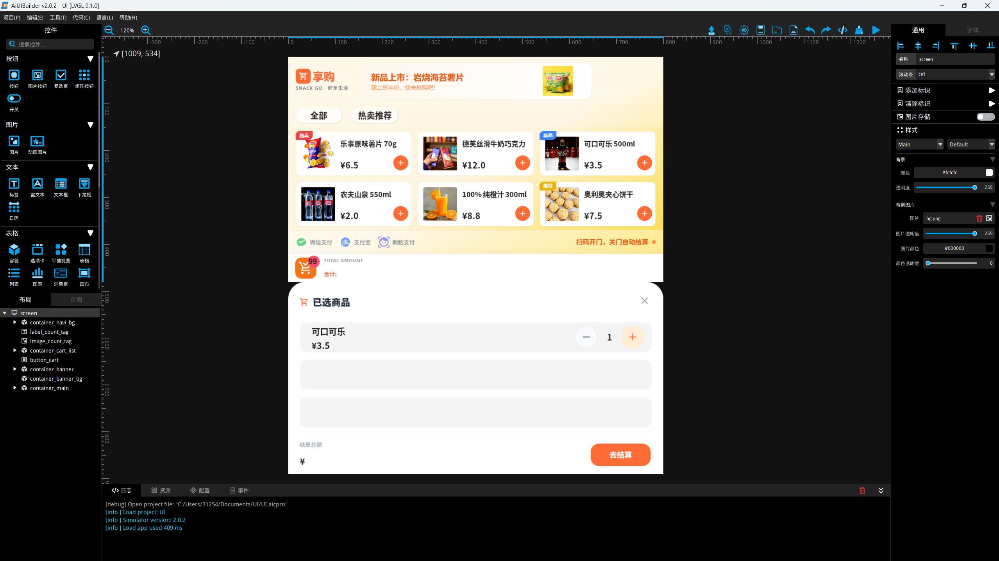
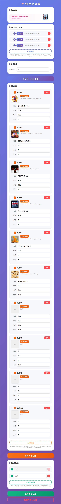

## 前言

LVGL 作为嵌入式领域最活跃的图形库，其核心是一个树形的**渲染树**（`lv_obj_t` 对象树），所有可见控件都是这棵树的节点。但在实际业务中，直接操作渲染树面临诸多问题：**静态布局无法动态更新**、**控件生命周期难以统一管理**、**组件间耦合紧密**。

本文以一个基于 **立创·衡山派D133EBS开发板 + LVGL v9 + RT-Thread** 的智能售货机终端为实践载体，深入剖析如何在 LVGL 渲染树之上构建一层**应用树**（`layout_node` 框架），通过组合模式、工厂模式、策略模式和发布-订阅模式的协同，实现 UI 的动态加载、热更新和生命周期管理。

---

## 一、双树架构：渲染树 vs 应用树

### 1.1 问题背景

项目由 AiUIBuilder v2.0.2 生成静态 UI 骨架（`ui_builder/screen.c`），在 800×480 屏幕上创建了横幅图片、商品卡片、购物车行、导航按钮等控件。但这些控件是**硬编码的静态对象**：

```c
// screen.c (AiUIBuilder 生成)
scr->image_banner_1 = lv_img_create(scr->container_banner);
scr->container_main_1 = lv_obj_create(scr->container_main);
// ...固定数量、固定数据、无法运行时增删
```



业务需求要求**运行时动态增删控件**（商品数量可变、购物车项动态添加、横幅可配置替换），直接操作渲染树会导致：

- 对象生命周期分散在各回调中，容易泄漏
- 无法批量销毁子树
- 布局参数硬编码，无法统一调整
- 组件间直接调用，紧耦合

#### 1.1.1 LVGL 原生的四大局限

LVGL 是一个优秀的轻量级嵌入式图形库，但其原生设计在应对复杂、动态、多层级的 UI 应用时会显现以下局限：

| 局限维度                       | 具体表现                                                                                                  | 原生做法痛点                                                                               |
| ------------------------------ | --------------------------------------------------------------------------------------------------------- | ------------------------------------------------------------------------------------------ |
| **渲染状态 vs 业务状态**       | `lv_obj_t` 保存的是渲染状态（坐标、尺寸、颜色），但不知道业务含义（如购物车数量是"3件商品"还是"3元总价"） | `lv_label_set_text(cart_label, "3")` 把业务逻辑和 UI 渲染死绑在一起，一旦对象销毁就野指针  |
| **静态配置 vs 动态生命周期**   | LVGL 鼓励启动时静态配置，但现代嵌入式 UI 高度动态（商品列表从网络下发，数量随时变）                       | 手动循环 `lv_obj_create`，手动计算坐标，大量 `lv_obj_del` 导致内存碎片，频繁创建销毁卡顿   |
| **硬编码布局 vs 策略化布局**   | Flex/Grid 仅是基础排版，复杂业务规则（缺货变灰、横屏每行从3变5）难以配置                                  | 业务代码里写满 `if (stock==0) lv_obj_add_state(card, LV_STATE_DISABLED)`，散落各处极难维护 |
| **单页面思维 vs 页面栈状态机** | 没有路由/页面栈概念，切换页面就是 `lv_obj_clean` 重建，无法保存状态（返回列表页滑动位置丢失）             | 每次重建从头渲染，用户交互状态全部丢失                                                     |

#### 1.1.2 一个通俗的比喻

把开发嵌入式 UI 比作盖房子：

- **LVGL 是砖头、水泥和涂料**。直接 `lv_obj_create` 就是一块一块垒砖头。
- **简单界面（狗窝）**：几个按钮几个文本，直接垒砖头最快最合适，不需要架构。
- **复杂界面（三十层商业大厦）**：智能终端多页面、网络数据动态刷新、多种交互状态，还坚持一块一块垒砖头，最后一定会塌方。你需要**建筑图纸和施工框架**（应用树），图纸定义了哪里是卫生间、哪里是承重墙（业务结构），具体怎么砌砖由施工队（LVGL 渲染引擎）按图纸执行。

#### 1.1.3 应用树填补的空白

LVGL 本身不提供完整应用框架来管理复杂 UI 状态和业务逻辑。应用树（`layout_node` + `layout_strategy`）填补这一空白：

- **结构化**：用树形组织 UI，清晰表达界面层级
- **策略化**：将布局算法抽象为可替换的策略
- **组件化**：通过工厂和对象池高效管理组件
- **异步化**：后台加载资源，保证流畅度
- **解耦化**：用事件总线实现业务逻辑与 UI 的松耦合通信

从而将 LVGL 从一个单纯的"画图工具"提升为能够支撑大型、复杂、可维护嵌入式 UI 应用的开发框架。

### 1.2 解决方案：应用树

在 LVGL 渲染树之上构建一棵**应用树**，每个应用树节点持有对应的 `lv_obj_t*`，并附加生命周期和布局管理能力：

```
应用树 (layout_node)
  container (strategy=Flex-Row)
  ├── widget_unit (banner_item, priv=...)
  ├── widget_unit (banner_item, priv=...)
  └── widget_unit (banner_item, priv=...)

渲染树 (lv_obj_t)
  lv_obj (LV_FLEX_FLOW_ROW)
  ├── lv_img (banner_1.png)
  ├── lv_img (banner_2.png)
  └── lv_img (banner_3.png)
```

应用树节点通过 `obj` 指针与渲染树节点一一对应，但应用树额外管理了：

| 管理维度   | 渲染树 (lv_obj_t)                  | 应用树 (layout_node)                 |
| ---------- | ---------------------------------- | ------------------------------------ |
| 生命周期   | `lv_obj_del()` 手动散落各处        | `destroy()` 虚函数，深度优先自动销毁 |
| 子节点管理 | LVGL 内部链表，无业务语义          | `children[]` 动态数组，容量倍增      |
| 布局参数   | 分散在各 `lv_obj_set_style_*` 调用 | `layout_strategy_t` 统一封装         |
| 数据绑定   | 手动逐字段赋值                     | `bind()` / `update()` 虚函数         |
| 私有数据   | 无标准机制                         | `widget_unit.priv` 指向内存池对象    |

---

## 二、组合模式：layout_node 核心设计

### 2.1 三层类型体系

应用树的核心是一个**组合模式 (Composite)** 的三层类型体系：

```c
/* 抽象基类 - 虚函数表 */
struct layout_node {
    lv_obj_t *obj;                          // 对应的渲染树节点
    const char *type_name;                  // 类型名（"container"/"banner_item"/...）
    layout_node_type_t node_type;           // CONTAINER 或 WIDGET
    layout_container_t *parent;             // 父容器引用

    void (*destroy)(layout_node_t *self);   // 虚函数：销毁
    void (*update)(layout_node_t *self,     // 虚函数：数据更新
                   const cJSON *data);
};

/* 容器节点 - 可含子节点 */
struct layout_container {
    layout_node_t base;                     // 继承基类
    layout_strategy_t strategy;             // 布局策略
    layout_node_t **children;               // 子节点动态数组
    int child_count;
    int child_capacity;
    // 方法指针: add_child, remove_child, clear, get_child
};

/* 叶子节点 - 最小可渲染单元 */
struct widget_unit {
    layout_node_t base;                     // 继承基类
    void *priv;                             // 私有数据（从内存池分配）
    void (*bind)(widget_unit_t *self,       // 数据绑定函数
                 const cJSON *data);
};
```

### 2.2 面向组合组件块的颗粒度

应用树节点的颗粒度是**业务级的组合组件块**，极少对应 LVGL 的原生基础对象（如单个 `lv_label`、`lv_btn`）。

#### 什么是组合组件块？

以售货机的"商品卡片"为例，在原生 LVGL 中它由以下 5 个对象组成：

- 1 个 `lv_obj`（最外层 container）
- 1 个 `lv_img`（商品图片）
- 2 个 `lv_label`（名称、价格）
- 1 个 `lv_btn`（购买按钮）

应用树的做法：

```c
// 应用树节点（组合组件）
widget_unit_t *card = widget_factory_create("commodity_card", parent);
card->base.obj = container;  // 指向组合组件最外层 container
card->priv = &card_data;     // 业务数据（商品ID、价格、库存）
```

一个 `widget_unit_t` 节点，`obj` 指针指向最外层 container，组件工厂内部一口气把这 5 个 `lv_obj_t` 都创建出来并组合好。

#### 块级销毁与安全回收

当页面切换或列表滑动导致某个商品卡片移出屏幕时：

| 原生做法                                                        | 应用树做法                                                                            |
| --------------------------------------------------------------- | ------------------------------------------------------------------------------------- |
| 手动找到 img, label1, label2, btn 分别 `lv_obj_del()`，极易漏删 | 直接销毁 `layout_node`，框架执行 `lv_obj_del(node->obj)`，LVGL 自动递归删除所有子对象 |
| 业务代码可能还在引用已删除对象，导致野指针崩溃                  | 应用树清空 `node->obj`，业务层不会再误触底层 UI                                       |

#### 挂起/激活机制：业务状态保留与肉体重建

在内存受限的 MCU 上，长列表有 100 个商品时不能创建 100 个 `lv_obj` 块（内存会爆）。应用树配合异步加载器实现：

- **保留 100 个 `layout_node`**（仅存几个字节的业务数据，内存占用极小）
- **仅创建屏幕可见的 5 个 `lv_obj` 块**

当用户滑动屏幕时：

```
滑出屏幕的块：
  应用树执行 lv_obj_del() 销毁 LVGL 肉体 → 释放显存
  但 layout_node 的业务数据（滑动偏移、选中状态）保留

滑入屏幕的块：
  应用树根据已有 layout_node → 调用工厂重新 lv_obj_create 造出肉体
  利用保留的业务数据恢复界面状态
```

这种"面向组合组件块"的管理方式，使得几百 KB 内存的 MCU 能流畅运行无限滚动列表、多页面嵌套的复杂 GUI。

### 2.4 深度优先销毁

`destroy()` 虚函数实现了**深度优先**的子树销毁，保证所有子节点先于父节点被回收：

```c
static void container_destroy(layout_node_t *self_base) {
    layout_container_t *self = (layout_container_t *)self_base;

    // 1. 先销毁所有子节点（深度优先）
    for (int i = 0; i < self->child_count; i++)
        layout_node_destroy(self->children[i]);

    // 2. 释放子节点数组
    rt_free(self->children);

    // 3. 销毁渲染树对象
    lv_obj_del(self->base.obj);

    // 4. 释放自身
    rt_free(self);
}
```

通用销毁调度器通过虚函数表实现多态：

```c
void layout_node_destroy(layout_node_t *node) {
    if (node && node->destroy)
        node->destroy(node);
}
```

这意味着调用者无需关心节点的具体类型，一个 `layout_node_destroy()` 即可销毁整棵子树。

### 2.5 子节点动态数组

容器使用动态数组管理子节点，初始容量 8，倍增扩容：

```c
#define LAYOUT_CHILDREN_INIT_CAP 8

static int children_ensure_capacity(layout_container_t *self, int needed) {
    if (needed <= self->child_capacity) return 0;

    int new_cap = self->child_capacity;
    while (new_cap < needed)
        new_cap *= 2;

    layout_node_t **new_arr = rt_malloc(sizeof(layout_node_t *) * new_cap);
    memcpy(new_arr, self->children, sizeof(layout_node_t *) * self->child_count);
    rt_free(self->children);
    self->children = new_arr;
    self->child_capacity = new_cap;
}
```

`add_child` 时自动扩容并应用布局策略中的子节点尺寸：

```c
void layout_container_add_child(layout_container_t *self, layout_node_t *child) {
    children_ensure_capacity(self, self->child_count + 1);
    child->parent = self;
    self->children[self->child_count++] = child;
    layout_strategy_apply_child_size(child->obj, &self->strategy);
}
```

`clear()` 清空所有子节点后，若容量超过初始值的 4 倍则缩容，避免长期运行后内存膨胀：

```c
void layout_container_clear(layout_container_t *self) {
    for (int i = 0; i < self->child_count; i++)
        layout_node_destroy(self->children[i]);
    self->child_count = 0;

    if (self->child_capacity > LAYOUT_CHILDREN_INIT_CAP * 4) {
        rt_free(self->children);
        self->children = rt_malloc(sizeof(layout_node_t *) * LAYOUT_CHILDREN_INIT_CAP);
        self->child_capacity = LAYOUT_CHILDREN_INIT_CAP;
    }
}
```

---

## 三、Wrap 桥接：从静态骨架到动态容器

### 3.1 两种创建方式

`layout_container` 提供两种创建方式，这是整个架构最关键的设计：

| 方式       | 函数                        | 创建 LVGL 对象         | 销毁 LVGL 对象                             | 用途                      |
| ---------- | --------------------------- | ---------------------- | ------------------------------------------ | ------------------------- |
| **Create** | `layout_container_create()` | 新建 `lv_obj_create()` | `container_destroy()` 中 `lv_obj_del()`    | 全新动态容器              |
| **Wrap**   | `layout_container_wrap()`   | 复用已有对象           | `container_destroy_wrapped()` 中**不**删除 | 桥接 AiUIBuilder 静态对象 |

### 3.2 Wrap 机制详解

`layout_container_wrap()` 接收一个**已存在的 `lv_obj_t*`**，将其包装为应用树容器，但**不改变对象所有权**：

```c
layout_container_t *layout_container_wrap(lv_obj_t *existing_obj,
                                          const layout_strategy_t *strategy) {
    layout_container_t *self = rt_malloc(sizeof(layout_container_t));
    memset(self, 0, sizeof(*self));

    // 复用已有对象，而非创建新对象
    self->base.obj = existing_obj;

    // 在已有对象上应用布局策略
    layout_strategy_apply(existing_obj, &self->strategy);

    // 使用特殊的销毁函数 - 不删除 LVGL 对象
    self->base.destroy = container_destroy_wrapped;

    return self;
}
```

`container_destroy_wrapped()` 的关键区别：

```c
static void container_destroy_wrapped(layout_node_t *self_base) {
    layout_container_t *self = (layout_container_t *)self_base;

    // 仍然销毁所有子节点（深度优先）
    for (int i = 0; i < self->child_count; i++)
        layout_node_destroy(self->children[i]);
    rt_free(self->children);

    // 关键：不删除 LVGL 对象，它由外部（screen_t）管理
    self->base.obj = NULL;

    rt_free(self);
}
```

### 3.3 实际桥接流程

在 `custom_init()` 中，桥接流程如下：

```
1. AiUIBuilder 生成:  scr->container_banner (lv_obj_t)
                       ├── scr->image_banner_1 (静态子控件)
                       ├── scr->image_banner_2
                       └── scr->image_banner_3

2. 删除静态子控件:    lv_obj_del(scr->image_banner_1);
                       lv_obj_del(scr->image_banner_2);
                       lv_obj_del(scr->image_banner_3);

3. Wrap 容器:         banner_comp->container = layout_container_wrap(
                           scr->container_banner, &flex_row_strategy);

4. 动态填充子节点:    for each image_path:
                         item = widget_factory_create("banner_item", container->base.obj);
                         container->add_child(container, &item->base);
                         item->bind(item, &path_data);
```

这样，AiUIBuilder 创建的 `container_banner` 仍然存在于渲染树中（由 `screen_t` 管理生命周期），但它的**子控件已全部替换为应用树管理的动态节点**，支持运行时增删、数据绑定和热更新。

---

## 四、策略模式：layout_strategy 布局引擎

### 4.1 策略配置结构

`layout_strategy_t` 将 LVGL 的分散布局 API 统一封装为一个配置结构：

```c
typedef struct {
    layout_type_t type;       // FLEX_ROW / FLEX_COLUMN / GRID
    int gap_x, gap_y;        // 间距
    int pad_x, pad_y;        // 内边距
    int cols;                 // Grid 列数
    int cell_w, cell_h;      // 子节点固定尺寸 (0=auto)
    bool scrollable;          // 是否可滚动
    lv_dir_t scroll_dir;      // 滚动方向
} layout_strategy_t;
```

### 4.2 策略应用

`layout_strategy_apply()` 将策略一次性映射到 LVGL Flex API：

```c
void layout_strategy_apply(lv_obj_t *obj, const layout_strategy_t *s) {
    switch (s->type) {
    case LAYOUT_FLEX_ROW:
        lv_obj_set_flex_flow(obj, LV_FLEX_FLOW_ROW);
        break;
    case LAYOUT_FLEX_COLUMN:
        lv_obj_set_flex_flow(obj, LV_FLEX_FLOW_COLUMN);
        break;
    case LAYOUT_GRID:
        // Grid = row-wrap，子节点通过 FLEX_IN_NEW_TRACK 换行
        lv_obj_set_flex_flow(obj, LV_FLEX_FLOW_ROW_WRAP);
        break;
    }

    lv_obj_set_flex_align(obj, LV_FLEX_ALIGN_START,
                              LV_FLEX_ALIGN_START,
                              LV_FLEX_ALIGN_START);

    lv_obj_set_style_pad_row(obj, s->gap_y, ...);
    lv_obj_set_style_pad_column(obj, s->gap_x, ...);

    if (s->scrollable) {
        lv_obj_add_flag(obj, LV_OBJ_FLAG_SCROLLABLE);
        lv_obj_set_scroll_dir(obj, s->scroll_dir);
    }
}
```

### 4.3 子节点尺寸应用

策略中的 `cell_w` 和 `cell_h` 定义了子节点的固定尺寸。当子节点被添加到容器时，`layout_strategy_apply_child_size()` 自动应用这些尺寸：

```c
void layout_strategy_apply_child_size(lv_obj_t *child_obj,
                                       const layout_strategy_t *s) {
    if (s->cell_w > 0)
        lv_obj_set_width(child_obj, s->cell_w);
    if (s->cell_h > 0)
        lv_obj_set_height(child_obj, s->cell_h);
}
```

这个函数在 `layout_container_add_child()` 中被调用：

```c
void layout_container_add_child(layout_container_t *self, layout_node_t *child) {
    children_ensure_capacity(self, self->child_count + 1);
    child->parent = self;
    self->children[self->child_count++] = child;
    // 关键：添加子节点时自动应用策略尺寸
    layout_strategy_apply_child_size(child->obj, &self->strategy);
}
```

**设计意义**：布局参数从分散的 API 调用（各组件文件里的 `lv_obj_set_size`）收拢到策略结构体，组件创建时只需关注"我是什么类型"，尺寸由父容器的策略统一控制。

### 4.4 四大组件的布局策略

在 `custom_init()` 中，四大组件各自使用不同的策略创建：

```c
// 横幅轮播 - Flex-Row，水平滚动
s_banner_comp = banner_component_create(
    scr->container_banner,
    &(layout_strategy_t){
        .type = LAYOUT_FLEX_ROW, .cell_w = 494, .cell_h = 78,
        .scrollable = true, .scroll_dir = LV_DIR_HOR,
    }, ...);

// 商品展示 - Grid 3列，垂直滚动
s_commodity_comp = commodity_component_create(
    scr->container_main,
    &(layout_strategy_t){
        .type = LAYOUT_GRID, .cols = 3,
        .gap_x = 12, .gap_y = 12, .cell_w = 240, .cell_h = 100,
        .scrollable = true, .scroll_dir = LV_DIR_VER,
    }, ...);

// 购物车 - Flex-Column，垂直滚动
s_cart_comp = cart_component_create(
    scr->container_cart_list_scroll,
    &(layout_strategy_t){
        .type = LAYOUT_FLEX_COLUMN, .gap_y = 10,
        .cell_w = 750, .cell_h = 70,
        .scrollable = true, .scroll_dir = LV_DIR_VER,
    });

// 导航栏 - Flex-Row，不可滚动
s_navi_comp = navi_component_create(
    scr->container_navi_bg,
    &(layout_strategy_t){
        .type = LAYOUT_FLEX_ROW, .gap_x = 8,
        .cell_w = 120, .cell_h = 35,
        .scrollable = false,
    }, ...);
```

布局参数从代码中分散的 `lv_obj_set_style_*` 调用，收拢为**一个结构体字面量**，一目了然。

---

## 五、工厂模式：widget_factory 动态创建

### 5.1 注册表设计

`widget_factory` 实现了按类型名字符串注册创建函数的**注册表模式**：

```c
typedef widget_unit_t *(*widget_create_fn)(lv_obj_t *parent);

static struct {
    const char *type_name;
    widget_create_fn create;
} s_entries[16];
static int s_entry_count = 0;
```

初始化阶段注册四种控件：

```c
void custom_init() {
    commodity_card_register();   // "commodity_card" -> commodity_card_create()
    banner_item_register();      // "banner_item"    -> banner_item_create()
    cart_item_register();        // "cart_item"      -> cart_item_create()
    navi_item_register();        // "navi_item"      -> navi_item_create()
}
```

### 5.2 运行时动态创建

组件工厂通过类型名动态创建控件，并自动加入应用树：

```c
// component_factory.c - 创建 banner 组件
for (int i = 0; i < initial_data->count; i++) {
    widget_unit_t *item =
        widget_factory_create("banner_item", comp->container->base.obj);
    if (item) {
        comp->container->add_child(comp->container, &item->base);
        item->bind(item, &path_data);  // 数据绑定
    }
}
```

每种控件的 `create()` 函数负责：

1. 从 RT-Thread 内存池分配 `widget_unit_t` 和私有数据结构
2. 创建 LVGL 渲染对象并设置样式
3. 设置 `bind()` 和 `destroy()` 虚函数
4. 返回初始化完成的 `widget_unit_t*`

---

## 六、组件工厂：应用树的组装单元

### 6.1 组件 = 容器 + 子控件 + 控制器

`component_factory` 在应用树之上封装**完整的业务组件**，每个组件由三部分组成：

```c
typedef struct {
    layout_container_t *container;     // 应用树容器
    banner_carousel_t *carousel;       // 控制器（不持有容器）
} banner_component_t;
```

以 banner 组件为例，`banner_component_create()` 的组装流程：

```
1. layout_container_wrap(parent, strategy)  → 创建应用树容器
2. widget_factory_create("banner_item", ...) × N  → 批量创建子控件
3. container->add_child(...) × N  → 加入应用树
4. item->bind(...) × N  → 绑定数据
5. banner_carousel_create(container, ...)  → 挂载控制器
```

### 6.2 控制器-容器分离

`banner_carousel` 是一个**纯粹的控制器**，它不创建也不拥有容器和子控件，只附加行为：

```c
struct banner_carousel {
    layout_container_t *container;    // 引用，非拥有
    lv_timer_t *auto_scroll_timer;   // 自动滚动定时器
    lv_obj_t **dots;                  // 指示器圆点
    int32_t last_scroll_x;           // 手势检测状态
    bool is_animating;
};
```

这种分离使得：

- 容器可以独立于控制器被销毁和重建
- 控制器可以在运行时切换到不同的容器实例
- 数据热更新时，控制器暂停 → 容器 clear → 重建子控件 → 控制器恢复

#### 6.2.1 自动轮播定时器

`banner_carousel` 创建一个 LVGL 定时器实现 5 秒间隔的自动滚动：

```c
carousel->auto_scroll_timer = lv_timer_create(
    auto_scroll_cb, 5000, carousel);

static void auto_scroll_cb(lv_timer_t *timer) {
    banner_carousel_t *carousel = timer->user_data;
    if (carousel->is_animating) return;  // 动画中不触发

    // 计算下一个索引（循环）
    int next_idx = (carousel->current_idx + 1) % carousel->container->child_count;

    // 滚动到目标位置
    lv_obj_scroll_to_x(carousel->container->base.obj,
                        next_idx * carousel->strategy.cell_w,
                        LV_ANIM_ON);

    carousel->current_idx = next_idx;
    update_dots_highlight(carousel);  // 同步指示器
}
```

#### 6.2.2 手势检测与用户交互暂停

当用户手指滑动横幅时，自动轮播暂停 10 秒，避免干扰：

```c
static void gesture_detect_cb(lv_event_t *e) {
    banner_carousel_t *carousel = lv_event_get_user_data(e);
    int32_t scroll_x = lv_obj_get_scroll_x(carousel->container->base.obj);

    if (abs(scroll_x - carousel->last_scroll_x) > 10) {
        // 检测到滑动：暂停自动滚动 10 秒
        lv_timer_pause(carousel->auto_scroll_timer);
        lv_timer_reset(carousel->resume_timer);  // 10 秒后恢复

        carousel->last_scroll_x = scroll_x;
    }
}
```

#### 6.2.3 指示器圆点同步

指示器是一组小圆点（`lv_obj`），数量与横幅图片一致，当前页高亮：

```c
static void create_dots(banner_carousel_t *carousel, lv_obj_t *parent) {
    int count = carousel->container->child_count;
    carousel->dots = rt_malloc(sizeof(lv_obj_t *) * count);

    for (int i = 0; i < count; i++) {
        lv_obj_t *dot = lv_obj_create(parent);
        lv_obj_set_size(dot, 8, 8);
        lv_obj_set_style_bg_color(dot, lv_color_hex(0xCCCCCC), 0);
        // 第一个默认高亮
        if (i == 0)
            lv_obj_set_style_bg_color(dot, lv_color_hex(0xFFFFFF), 0);
        carousel->dots[i] = dot;
    }
}

static void update_dots_highlight(banner_carousel_t *carousel) {
    for (int i = 0; i < carousel->container->child_count; i++) {
        lv_obj_set_style_bg_color(
            carousel->dots[i],
            i == carousel->current_idx ? lv_color_hex(0xFFFFFF) : lv_color_hex(0xCCCCCC),
            0);
    }
}
```

### 6.3 数据热更新

`banner_carousel_update_data()` 展示了应用树的热更新流程：

```c
void banner_carousel_update_data(banner_carousel_t *carousel,
                                  const carousel_data_t *data) {
    // 1. 暂停自动滚动
    lv_timer_pause(carousel->auto_scroll_timer);

    // 2. 销毁旧指示器
    destroy_dots(carousel);

    // 3. 清空容器子节点（深度优先销毁所有旧 banner_item）
    carousel->container->clear(carousel->container);

    // 4. 从新数据创建子控件
    for (int i = 0; i < data->count; i++) {
        widget_unit_t *item = widget_factory_create("banner_item", ...);
        carousel->container->add_child(carousel->container, &item->base);
        item->bind(item, &path_data);
    }

    // 5. 重建指示器（延迟 50ms 等 LVGL 布局完成）
    schedule_dots_init(carousel);

    // 6. 恢复自动滚动
    lv_timer_resume(carousel->auto_scroll_timer);
}
```

整个流程对调用者透明——只需传入新数据，应用树自动完成**销毁旧节点 → 创建新节点 → 数据绑定 → 布局重排**。

---

## 七、事件驱动：跨组件通信与配置热更新

### 7.1 事件总线

`event_bus` 实现发布-订阅解耦，定义了 8 种事件类型：

```c
typedef enum {
    EVT_CART_ITEM_ADDED,       // 商品加购
    EVT_CART_ITEM_REMOVED,     // 购物车移除
    EVT_CART_COUNT_CHANGED,    // 数量变化
    EVT_CART_PRICE_CHANGED,    // 价格变化
    EVT_BANNER_CONFIG_CHANGED, // Banner 配置变更
    EVT_COMMODITY_CONFIG_CHANGED, // 商品配置变更
    EVT_NAVI_CONFIG_CHANGED,   // 导航配置变更
    EVT_NAVI_ITEM_CLICKED,     // 导航点击
} event_type_t;
```

### 7.2 配置热更新的完整链路

Web 配置触发的事件链路，展示了从 HTTP 请求到 UI 重渲染的完整流程：

```
HTTP POST /api/config
  ├── HTTP 线程: 解析 JSON → 写入 s_pending_json → 设置 s_pending_update=1
  ├── HTTP 线程: 保存 JSON 到 /sdcard/config/banner.json（持久化）
  └── LVGL 定时器 (200ms): 检测 s_pending_update
      ├── 发布 EVT_BANNER_CONFIG_CHANGED (data=json_str)
      └── on_banner_config_changed() 订阅者:
          ├── carousel_data_from_json(json_str, &data)
          └── banner_component_update(comp, &data)
              └── banner_carousel_update_data()
                  ├── 暂停定时器
                  ├── container->clear()     ← 销毁旧应用树子节点
                  ├── widget_factory_create() ← 创建新应用树子节点
                  ├── container->add_child()  ← 加入应用树
                  ├── item->bind()            ← 数据绑定
                  ├── schedule_dots_init()    ← 重建指示器
                  └── 恢复定时器
```

**关键**：HTTP 线程绝不直接调用 LVGL API，仅设置 volatile 标志；所有 UI 操作在 LVGL 定时器的 LVGL 线程上下文中执行，保证线程安全。

### 7.3 跨组件联动

商品卡片加购不直接调用购物车 API，而是通过事件总线：

```
commodity_card 点击加购
    → event_bus_publish(EVT_CART_ITEM_ADDED, {name, price})
    → cart_module 订阅处理
        → cart_add_commodity()
        → event_bus_publish(EVT_CART_PRICE_CHANGED, {total_price})
        → qr_scanner 订阅处理
            → qr_scanner_set_payment_info()  // 支付金额始终与购物车同步
```

三个模块零直接依赖，完全通过事件总线通信。

### 7.4 RT-Thread 线程安全：引用与隔离

LVGL 有一个铁律：**所有对 `lv_obj_t` 的操作必须在同一个线程（LVGL 线程）中进行**。如果业务线程（网络、传感器）直接调用 `lv_label_set_text()`，系统大概率崩溃。

#### 7.4.1 线程物理隔离

```
LVGL 渲染线程                业务工作线程
lv_timer_handler()           网络通信/数据处理
lv_tick_inc()                硬件读写
只负责渲染                    不触碰 lv_obj_t
```

业务线程绝对拿不到 `lv_obj_t` 指针，只能操作纯业务数据（C 结构体）。

#### 7.4.2 RT-Thread 消息队列桥梁

业务线程通过 RT-Thread 消息队列通知 UI 线程刷新：

```c
// 定义跨线程消息
typedef struct {
    event_type_t type;
    layout_node_t *target_node;  // 引用应用树节点（不碰 lv_obj）
    void *data;
} app_msg_t;

// RT-Thread 消息队列初始化
struct rt_messagequeue ui_mq;
rt_mq_init(&ui_mq, "ui_mq",
           rt_malloc(sizeof(app_msg_t) * 16),
           sizeof(app_msg_t), 16, RT_IPC_FLAG_FIFO);

// 业务线程发送更新请求（隔离且安全）
void network_thread_handle_new_price(uint8_t price) {
    app_msg_t msg = {
        .type = EVT_CART_PRICE_CHANGED,
        .target_node = g_cart_node,  // 引用节点，不碰 lv_obj
        .data = &price
    };
    rt_mq_send(&ui_mq, &msg, sizeof(app_msg_t));
    // 业务线程工作完成，绝不阻塞 UI 线程
}

// LVGL 线程接收并驱动渲染
void lvgl_thread_entry(void *param) {
    app_msg_t recv_msg;
    while (1) {
        if (rt_mq_recv(&ui_mq, &recv_msg, sizeof(app_msg_t), RT_WAITING_FOREVER) == RT_EOK) {
            // 在 LVGL 线程安全地更新 UI
            switch (recv_msg.type) {
                case EVT_CART_PRICE_CHANGED:
                    cart_node_set_price(recv_msg.target_node, *(uint8_t*)recv_msg.data);
                    break;
            }
        }
        lv_timer_handler();  // 渲染
    }
}
```

#### 7.4.3 引用与隔离的精髓

| 机制         | 作用                                                             |
| ------------ | ---------------------------------------------------------------- |
| **线程隔离** | 业务跑独立线程，看不到 `lv_obj_t`；UI 跑独立线程，不关心业务协议 |
| **消息队列** | 业务线程引用应用树节点指针，把数据丢进队列后转身就走             |
| **安全渲染** | UI 线程拿到指针后，在 LVGL 线程上下文安全操作底层 `lv_obj`       |

在这套架构下，即使网络线程疯狂发消息，LVGL 渲染线程仍能以自己节奏从队列取消息并平滑刷新，绝不死机或卡顿。

---

## 八、从静态到动态：custom_init() 的替换流程

`custom_init()` 是系统组装入口，完整展示了从 AiUIBuilder 静态骨架到动态应用树的替换过程：

### 8.1 SD卡挂载与资源路径管理

动态组件的图片资源存放在 SD 卡，启动时必须先挂载：

```c
static int ensure_sdcard_mounted(void) {
    if (dfs_mount("sd0", "/sdcard", "elm", 0, 0) == 0)
        return 0;  // 已挂载

    // 重试最多 5 次
    for (int i = 0; i < 5; i++) {
        rt_thread_mdelay(100);
        if (dfs_mount("sd0", "/sdcard", "elm", 0, 0) == 0)
            return 0;
    }

    rt_kprintf("SD card mount failed, use default paths\n");
    return -1;
}
```

挂载成功后，资源路径标准化：

| 资源类型    | SD卡路径                     | 用途          |
| ----------- | ---------------------------- | ------------- |
| Banner 图片 | `/sdcard/banner/xxx.png`     | 轮播横幅      |
| 商品图片    | `/sdcard/commodity/xxx.png`  | 商品卡片      |
| 配置文件    | `/sdcard/config/banner.json` | Web配置持久化 |

所有路径在 `web_config.c` 中统一管理，避免硬编码散落各处。

### 8.2 完整初始化流程

```
Step 1: 初始化基础设施
  event_bus_init() + async_loader_init()

Step 2: 挂载 SD 卡（资源路径准备）
  ensure_sdcard_mounted()

Step 3: 初始化对象池
  banner_item_module_init()    // rt_mp_create, 容量=10
  commodity_module_init()      // rt_mp_create, 容量=30
  cart_module_init()           // rt_mp_create, 容量=20
  navi_item_module_init()      // rt_mp_create, 容量=10

Step 3: 注册控件工厂
  commodity_card_register()    // "commodity_card" → create_fn
  banner_item_register()       // "banner_item"    → create_fn
  cart_item_register()         // "cart_item"      → create_fn
  navi_item_register()         // "navi_item"      → create_fn

Step 4: 获取 AiUIBuilder 生成的屏幕对象
  screen_t *scr = screen_get(&ui_manager);

Step 5: 删除静态子控件，替换为动态组件
  // Banner: 删除 3 个静态图片
  lv_obj_del(scr->image_banner_1);
  lv_obj_del(scr->image_banner_2);
  lv_obj_del(scr->image_banner_3);
  // Wrap 容器 + 动态填充
  s_banner_comp = banner_component_create(scr->container_banner, ...);

  // Commodity: 删除 6 个静态容器
  lv_obj_del(scr->container_main_1~6);
  // Wrap 容器 + 动态填充
  s_commodity_comp = commodity_component_create(scr->container_main, ...);

  // Cart: 删除 8 个静态控件
  lv_obj_del(scr->image_cart_item_bg_1~3);
  lv_obj_del(scr->button_cart_item_add_1);
  // ...
  // Wrap 容器（初始为空，事件驱动添加）
  s_cart_comp = cart_component_create(scr->container_cart_list_scroll, ...);

  // Navi: 删除 2 个静态容器
  lv_obj_del(scr->container_navi_1~2);
  // Wrap 容器 + 动态填充
  s_navi_comp = navi_component_create(scr->container_navi_bg, ...);

Step 6: 事件订阅 + 启动业务模块
  event_bus_subscribe(EVT_BANNER_CONFIG_CHANGED, ...);
  event_bus_subscribe(EVT_COMMODITY_CONFIG_CHANGED, ...);
  web_config_init();
  uart3_payment_init();
  qr_scanner_init();
```

**核心思路**：保留 AiUIBuilder 创建的**容器对象**（如 `container_banner`），删除其**静态子控件**，然后通过 Wrap 机制将容器纳入应用树管理，再通过控件工厂动态填充可数据驱动的子节点。

### 8.3 购物车开合动画

购物车列表默认隐藏，点击结算按钮时展开，通过 LVGL 动画 API 实现：

```c
// 展开动画：高度从 0 → 400，透明度从 0 → 255
static void cart_list_open_anim(lv_obj_t *cart_container) {
    lv_anim_t a;
    lv_anim_init(&a);
    lv_anim_set_var(&a, cart_container);
    lv_anim_set_exec_cb(&a, lv_obj_set_height);
    lv_anim_set_values(&a, 0, 400);
    lv_anim_set_time(&a, 300);
    lv_anim_set_path_cb(&a, lv_anim_path_ease_out);
    lv_anim_start(&a);

    // 同步透明度动画
    lv_anim_set_exec_cb(&a, lv_obj_set_style_opa);
    lv_anim_set_values(&a, LV_OPA_TRANSP, LV_OPA_COVER);
    lv_anim_start(&a);
}

// 收起动画：反向过程
static void cart_list_close_anim(lv_obj_t *cart_container) {
    lv_anim_t a;
    lv_anim_init(&a);
    lv_anim_set_var(&a, cart_container);
    lv_anim_set_exec_cb(&a, lv_obj_set_height);
    lv_anim_set_values(&a, 400, 0);
    lv_anim_set_time(&a, 300);
    lv_anim_set_path_cb(&a, lv_anim_path_ease_in);
    lv_anim_start(&a);

    lv_anim_set_exec_cb(&a, lv_obj_set_style_opa);
    lv_anim_set_values(&a, LV_OPA_COVER, LV_OPA_TRANSP);
    lv_anim_start(&a);
}
```

动画触发由结算按钮点击事件驱动，配合应用树的购物车容器：

```c
static void settlement_btn_click_cb(lv_event_t *e) {
    if (g_cart_list_visible) {
        cart_list_close_anim(s_cart_comp->container->base.obj);
        g_cart_list_visible = false;
    } else {
        cart_list_open_anim(s_cart_comp->container->base.obj);
        g_cart_list_visible = true;
    }
}
```

**设计要点**：动画操作的是应用树容器对应的 `lv_obj_t`，但控制逻辑在业务层（`g_cart_list_visible` 标志），体现了数据与渲染的分离。

---

## 九、内存管理策略

### 9.1 对象池 vs 堆分配

| 对象                       | 分配方式      | 原因                              |
| -------------------------- | ------------- | --------------------------------- |
| `layout_container_t`       | `rt_malloc`   | 生命周期长，数量少（4个组件容器） |
| `layout_node_t **children` | `rt_malloc`   | 需倍增扩容，不适用固定大小池      |
| `widget_unit_t` + `priv`   | `rt_mp_alloc` | 高频创建/销毁，需避免碎片         |
| `navi_click_ctx_t`         | `rt_malloc`   | 与事件回调生命周期绑定            |

### 9.2 对象池容量对齐

每个控件模块独立管理内存池，容量与业务上限对齐：

- `banner_item`: 容量 10（最多 10 张横幅）
- `commodity_card`: 容量 30（最多 30 件商品）
- `cart_item`: 容量 20（最多 20 个购物车项）
- `navi_item`: 容量 10（最多 10 个导航标签）

---

## 十、架构总结

### 10.1 设计模式协同

```
component_factory (组装层: 容器 + 子控件 + 控制器)
widget_factory (工厂模式) | layout_strategy (策略模式) | event_bus (Pub-Sub)
layout_node (组合模式)
  container ─┬─ widget_unit (叶子)
             ├─ widget_unit
             └─ container ─┬─ widget_unit
                           └─ ...
LVGL 渲染树 (lv_obj_t)
```

### 10.2 核心价值

1. **Wrap 桥接**：`layout_container_wrap()` 是连接静态骨架与动态应用树的桥梁，保留可视化工具的快速原型能力，同时获得运行时灵活性。

2. **深度优先销毁**：`destroy()` 虚函数递归销毁子树，消除了手动 `lv_obj_del()` 散落各处的生命周期管理问题。

3. **数据驱动重建**：`clear()` → `widget_factory_create()` → `add_child()` → `bind()` 的标准化流程，使热更新逻辑高度统一。

4. **策略封装**：布局参数从分散的 API 调用收拢为 `layout_strategy_t` 结构体，组件创建时一目了然。

5. **事件解耦**：组件间零直接依赖，购物车不知道商品卡片，支付模块不知道购物车，Web 配置不知道任何 UI API。

---

## 十一、串口支付流程

### 11.1 帧协议

设备与 PC 主机通过 UART3 通信，采用自定义帧协议：

```
AA 55 CMD LEN_H LEN_L DATA... 0D 0A
```

| 方向      | CMD  | 名称              | 数据                           |
| --------- | ---- | ----------------- | ------------------------------ |
| PC → 设备 | 0x01 | CMD_QR_URL        | 二维码 URL (UTF-8)             |
| PC → 设备 | 0x02 | CMD_PAY_STATUS    | 支付状态码 (1字节)             |
| PC → 设备 | 0x03 | CMD_ORDER_NO      | 订单号 (UTF-8)                 |
| PC → 设备 | 0x04 | CMD_HEARTBEAT_ACK | 心跳应答                       |
| 设备 → PC | 0x81 | CMD_REQ_QR        | name\0amount                   |
| 设备 → PC | 0x82 | CMD_REQ_QUERY     | 空                             |
| 设备 → PC | 0x83 | CMD_REQ_CLOSE     | 空                             |
| 设备 → PC | 0x84 | CMD_HEARTBEAT     | 空                             |
| 设备 → PC | 0x85 | CMD_BARCODE_PAY   | auth_code\0[amount\0][subject] |

### 11.2 双支付模式

**模式一：用户扫码**

1. 用户点击结算按钮 → 解析购物车总价 → 显示支付模式选择弹窗
2. 用户选择"用户扫码" → 发送 `CMD_REQ_QR` 到 PC
3. PC 生成支付宝沙箱订单，返回 `CMD_QR_URL`
4. 设备显示 QR 码覆盖层（240×240，LVGL `lv_qrcode` 控件）
5. PC 轮询支付状态后返回 `CMD_PAY_STATUS`
6. 成功：显示"支付成功!"，2 秒后自动隐藏，清空购物车，恢复轮播

**模式二：设备扫码（条码支付）**

1. 用户选择"设备摄像头扫码"
2. 启动 DVP 摄像头 + quirc 扫描线程
3. 设置 UI 层 alpha=128 使视频层透视显示
4. quirc 扫描到 18~28 位纯数字（支付授权码）后，通过 `CMD_BARCODE_PAY` 发送至 PC
5. PC 调用支付宝条码支付 API，返回支付状态
6. 成功后流程同上

### 11.3 线程安全设计

UART3 RX 线程严格不调用任何 LVGL API。帧解析完成后仅入队到 SPSC 环形缓冲区。LVGL 定时器 (100ms) 在 LVGL 线程上下文出队处理，确保所有 UI 操作的线程安全。

---

## 十二、二维码扫描模块

### 12.1 硬件配置

- DVP 摄像头 (OV5640)，强制 QVGA 320×240 输出，降低内存占用（约 460KB）
- ArtInChip 视频输入框架 (`mpp_vin`, `drv_dvp`)
- Framebuffer 视频层 (`mpp_fb`) 用于摄像头预览
- quirc QR 码解码库

### 12.2 扫描流程

1. `qr_scanner_start()`：初始化 DVP（含 5 次重试容错）、配置传感器格式、创建 quirc 实例 (160×120，2 倍下采样)
2. 扫描线程循环：`dq_buf` → 丢弃前几帧 → 每 5 帧提取 Y 通道并下采样 → `quirc_decode`
3. `handle_qr_result()`：检测是否为支付授权码（18~28 位纯数字），同码 5 秒冷却，调用 `uart3_payment_send_barcode()` 发送

### 12.3 摄像头视图模式

通过 ArtInChip framebuffer 的视频层直接显示 DVP 采集帧：

- `qr_scanner_start_camera_view()`：打开 framebuffer，设置 UI 层 alpha=128
- DVP 缓冲区零拷贝推送到视频层，实现高性能画中画效果
- 停止时严格顺序：清标志 → 停扫描线程 → 停 DVP 流 → 等线程退出 → 禁用视频层 + 恢复 UI alpha → 释放资源

---

## 十三、Web 配置系统



> [!NOTE]
> 想要查看源码？[web_config.html](https://gitee.com/ling-sir007/luban-lite/blob/master/packages/artinchip/lvgl-ui/aic_demo/vending_demo/config/web_config.html)

### 13.1 架构

设备启动 WiFi AP（SSID: `AIC-Banner-Config`，密码: `12345678`，信道 6），IP 地址 192.168.1.1，运行 DHCP 服务器，在 80 端口启动 Mongoose HTTP 服务器。

### 13.2 API 接口

| 方法 | 路径                               | 功能                            |
| ---- | ---------------------------------- | ------------------------------- |
| GET  | `/`                                | 嵌入式 HTML 配置页面            |
| GET  | `/api/config`                      | 获取 Banner 配置 JSON           |
| GET  | `/api/commodity`                   | 获取商品配置 JSON               |
| GET  | `/api/navi`                        | 获取导航配置 JSON               |
| POST | `/api/config`                      | 更新 Banner 配置                |
| POST | `/api/commodity`                   | 更新商品配置                    |
| POST | `/api/navi`                        | 更新导航配置                    |
| POST | `/api/reset`                       | 重置为默认配置                  |
| POST | `/api/upload/{filename}`           | 上传 Banner 图片（校验 494×78） |
| POST | `/api/upload/commodity/{filename}` | 上传商品图片（校验 80×80）      |

### 13.3 安全措施

- 文件名白名单校验：仅允许字母、数字、`.`、`_`、`-`，长度不超过 64
- Content-Length 早期拒绝：超限直接返回 413
- 接收缓冲区限制：`recv_mbuf.len > 307200 + 4096` 时强制关闭连接
- 图片尺寸校验：解析 PNG/JPEG/BMP 文件头验证宽高，不匹配则删除并返回错误
- 价格格式校验：支持多种货币前缀，验证必须包含数字和可选小数部分

### 13.4 配置热更新

1. HTTP 线程接收 POST → 解析 JSON → 写入 `s_pending_json` 缓冲区 → 设置标志
2. 同时将 JSON 保存到 SD 卡文件实现持久化
3. LVGL 定时器 200ms 轮询检测标志 → 发布事件 → 各组件执行热更新

### 13.5 商品与导航分类系统

商品卡片的 `tag` 和 `navi_tag` 是两个独立维度，分别服务于不同目的：

| 字段       | 用途                       | 取值范围                       | 来源             |
| ---------- | -------------------------- | ------------------------------ | ---------------- |
| `tag`      | 商品卡片左上角**显示图标** | `hot`/`new`/`recommend`/`none` | Web 配置手动选择 |
| `navi_tag` | 导航栏**分类筛选**归属     | 各手动创建的 navi 项 tag       | Web 配置分类下拉 |

**导航项管理规则**：

1. 默认存在"全部"项（tag=`all`），不可删除、不可编辑
2. 用户手动添加导航项（最多 10 个），tag 由 label 自动生成（如 label="饮料" → tag="饮料"）
3. 导航项变更（增/删/改）时，立即刷新商品卡片的分类下拉选项

**商品卡片分类归属**：

- 每个商品卡片在 Web 配置页面中显示"分类"下拉框，选项为当前所有 navi 项（排除"全部"），外加"无"选项
- 选择后写入 `navi_tag` 字段，用于运行时筛选
- 点击导航栏某项时，`commodity_apply_filter()` 按 `navi_tag` 过滤商品列表

```c
/* commodity_card_priv_t 中的关键字段 */
typedef struct {
    // ...
    commodity_tag_t tag;       /* 显示图标：热卖/新品/推荐/无 */
    char navi_tag[32];         /* 导航分类标签，用于筛选 */
} commodity_card_priv_t;
```

**运行时筛选逻辑**（`commodity_apply_filter`）：

```c
/* 按 navi_tag 过滤商品 */
cJSON *filtered = cJSON_CreateArray();
int count = cJSON_GetArraySize(items);
for (int i = 0; i < count; i++) {
    cJSON *item = cJSON_GetArrayItem(items, i);
    cJSON *navi_tag = cJSON_GetObjectItem(item, "navi_tag");
    if (cJSON_IsString(navi_tag) &&
        strcmp(navi_tag->valuestring, filter_tag) == 0) {
        cJSON_AddItemToArray(filtered, cJSON_Duplicate(item, 1));
    }
}
```

**数据绑定安全性**：当商品卡片字段为空时，必须清除旧的显示值，避免残影：

```c
/* 图片为空时清空旧值 */
cJSON *image = cJSON_GetObjectItem(data, "image");
if (cJSON_IsString(image) && image->valuestring[0] != '\0') {
    lv_img_set_src(p->img, image->valuestring);
    strncpy(p->image, image->valuestring, sizeof(p->image) - 1);
} else {
    lv_img_set_src(p->img, NULL);   /* 清除残影 */
    p->image[0] = '\0';
}
```

### 13.6 源码目录组织

源码从扁平的 `my_custom_init/` 重构为按功能分类的 `vending_demo/` 目录树：

```
vending_demo/
├── core/          # event_bus.c/h, async_loader.c/h
├── layout/        # layout_node.c/h, layout_strategy.c/h, widget_factory.c/h
├── banner/        # banner_item.c/h, banner_carousel.c/h, banner_types.h
├── commodity/     # commodity_card.c/h
├── cart/          # cart_item.c/h
├── navi/          # navi_item.c/h
├── config/        # web_config.c/h, web_config.html → web_config_html.c
└── payment/       # uart3_payment.c/h, qr_scanner.c/h
```

SConscript 使用 `os.walk()` 递归扫描 `vending_demo/` 及其子目录，收集 `.c` 文件和头文件路径：

```python
vending_path = cwd + '/vending_demo'
if os.path.exists(vending_path):
    for root, dirs, files in os.walk(vending_path):
        rela_path = root.replace(cwd + '/', '')
        src = src + Glob(rela_path + '/*.c')
        if check_h_hpp_exist(root):
            inc = inc + [root]
    html_src = os.path.join(cwd, 'vending_demo', 'config', 'web_config.html')
    html_c = os.path.join(cwd, 'vending_demo', 'config', 'web_config_html.c')
```

`web_config_html.c` 由 `web_config.html` 在构建时自动生成，包含嵌入式 HTML 字符串常量，供 Mongoose HTTP 服务器直接返回，无需文件系统读取。

---

## 十四、异步加载机制

基于 RT-Thread 线程 + 双消息队列实现：

```
主线程 (LVGL)              工作线程
    |                                                 |
    | submit(task)                         |
    | ----[task_mq]---->              |
    |                                                 | work_fn(arg) → result
    |                                [result_mq]----> done_cb(result)
    |                                                 |
    | poll() <-- 排空 result_mq   |
```

- 工作线程栈：4096 字节，优先级 20
- 任务/结果队列容量：8 条
- `async_loader_poll()` 在 LVGL 定时器中调用，保证 `done_cb` 在 LVGL 线程安全执行

---

## 十五、技术亮点总结

1. **Wrap 桥接**：`layout_container_wrap()` 是连接静态骨架与动态应用树的桥梁，保留可视化工具的快速原型能力，同时获得运行时灵活性。

2. **深度优先销毁**：`destroy()` 虚函数递归销毁子树，消除了手动 `lv_obj_del()` 散落各处的生命周期管理问题。

3. **数据驱动重建**：`clear()` → `widget_factory_create()` → `add_child()` → `bind()` 的标准化流程，使热更新逻辑高度统一。

4. **策略封装**：布局参数从分散的 API 调用收拢为 `layout_strategy_t` 结构体，组件创建时一目了然。

5. **事件解耦**：组件间零直接依赖，购物车不知道商品卡片，支付模块不知道购物车，Web 配置不知道任何 UI API。

6. **嵌入式 Web 配置**：RT-Thread 上运行 Mongoose HTTP 服务器 + WiFi AP，手机连接热点即可修改配置，无需固件升级，配置自动持久化到 SD 卡。

7. **双支付模式**：支持"用户扫码"和"设备扫码"两种模式，通过 UART3 与 PC 主机通信，实现支付宝沙箱环境下的完整支付闭环。

8. **无锁线程间通信**：UART3 使用 SPSC 环形队列，Web 配置使用 volatile 标志 + 缓冲区，均避免重量级锁开销。

9. **内存池管理**：所有高频创建/销毁的控件使用 RT-Thread 内存池，容量与业务上限对齐，避免内存碎片。

10. **摄像头视图硬件加速**：DVP 缓冲区零拷贝推送到视频层，UI 层半透明实现画中画效果。

11. **tag/navi_tag 双维度分类**：tag 控制商品卡片显示图标，navi_tag 控制导航栏筛选归属，两个维度独立管理、互不干扰，分类变更实时刷新商品选项。

12. **递归目录构建**：SConscript 通过 `os.walk()` 递归扫描 `vending_demo/` 子目录，支持按功能归档的目录结构，`web_config_html.c` 构建时自动生成。
