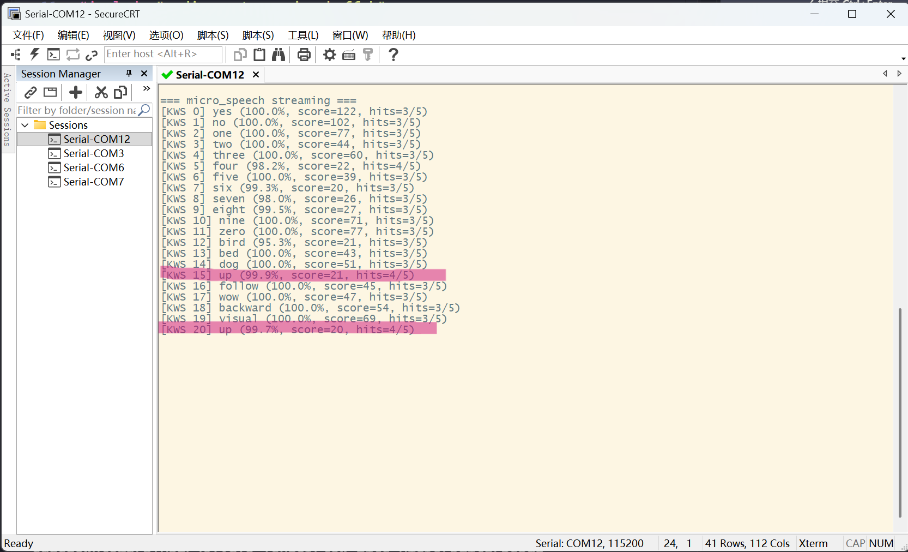

## Introduction

The goal of this project: run micro_speech model's **streaming** keyword spotting on STM32F407VGT6 with an INMP441 I2S MEMS microphone — the user speaks at any time, and the system recognizes yes/no/up/down/... in real time, without needing to pre-record and feed the entire clip to the model.

The reference project is ST's official [STM32N6-GettingStarted-Audio](file:///d:/edgedownload/STM32N6-GettingStarted-Audio), which already implements a complete streaming acquisition + inference pipeline. But when porting it to STM32F407 + INMP441, I encountered five pitfalls, each with completely different symptoms:

| #   | Pitfall          | Symptom                                      | Root Cause                                                |
| --- | ---------------- | -------------------------------------------- | --------------------------------------------------------- |
| 1   | stride error     | Recognition results randomly jump, score 14~30 | STM32F4 I2S 16B_EXTENDED frame layout doesn't match assumptions |
| 2   | volatile missing | Deleting one printf line kills all output    | ISR/main shared variable cached in register by `-O3 -flto` |
| 3   | Insufficient stack margin | Preventive optimization (no clear symptoms observed) | Large arrays on stack, default 2KB stack margin is dangerous |
| 4   | KWS false positives | Noise recognized as up, continuous triggers | int8 quantized score has low discrimination + per-word cooldown reset |
| 5   | Hidden dependency | Compile error: cannot find array.h           | kernel_util.cpp depends on upstream TFL's array.cc        |

This article first covers the architecture top-down following the data flow, then debugging in chronological order of encountering pitfalls. Each pitfall includes a **Symptom → Root Cause → Fix** three-part analysis, so readers with similar issues can quickly find their match.

> [!NOTE]
> This is not a step-by-step tutorial; it assumes readers are familiar with STM32 HAL, I2S, DMA, and TFLite basics. The focus is on **pitfalls and architecture**, not building from scratch. For model training, see my previous post [WSL2 + Docker + TensorFlow Tutorial](../wsl2-docker-tensorflow/).

---

## 1. Project Overview

### 1.1 Hardware Configuration

| Component    | Model / Configuration                                                        |
| ------------ | ---------------------------------------------------------------------------- |
| MCU          | STM32F407VGT6 (Cortex-M4F, 168 MHz, 1 MB Flash, 192 KB RAM incl. 64 KB CCMRAM) |
| Microphone   | INMP441 I2S MEMS (24-bit, L/R pin grounded = left channel)                  |
| I2S Interface | I2S2, Philips standard, 16B_EXTENDED, 16 kHz stereo                        |
| DMA          | DMA1_Stream3 / Channel0, Circular, half-word aligned                        |
| Debugger     | J-Link                                                                       |
| Model        | micro_speech int8 quantized (36 labels)                                     |
| Inference Framework | TensorFlow-Lite-Micro + X-CUBE-AI integration                        |

### 1.2 Software Data Flow

The entire streaming KWS pipeline is divided into five layers, from microphone to keyword output:

```
[INMP441]
   │ I2S2 24-bit @ 16 kHz
   ▼

audio/capture/                       ← Layer 1: I2S DMA ping-pong
  • DMA double buffer (640 halfwords)
  • Half/Full IRQ every 10 ms
  • Left channel de-interleaving [L,R] → [L]
  • Per-block mean subtraction for DC removal
   ▼ feed (160 samples / 10 ms)

audio/capture/                       ← Layer 2: Ring buffer
  AudioCaptureRingBuff_t
  4 × 3200 = 12800 samples (25.6 KB, stored in CCMRAM)
  LDREX/STREX atomic counter
  volatile ensures ISR/main visibility
   ▼ consume (3200 samples / 200 ms)

audio/frontend/                      ← Layer 3: MFCC sliding window
  • 1-second window (16000 samples)
  • SLIDE_COLS=10 (200 ms)
  • CMSIS-DSP RFFT Q15
  • 40-channel Mel filterbank
  • Stored in CCMRAM (along with ring buffer)
   ▼ 49×40 int8 features

X-CUBE-AI                            ← Layer 4: int8 inference
  micro_speech model (~50 ms)
   ▼ 36 int8 logits

audio/kws/                           ← Layer 5: KWS post-processing
  • Filter _silence_/_unknown_
  • N-in-M debouncing (3/5)
  • Global cooldown (5 frames ≈ 1 s)
  • Score threshold (>= 20)
  • Softmax probability display
   ▼

[KWS N] yes (100.0%, score=83)
```

Each layer is an independent `.c/.h` module, ultimately wired together through `X-CUBE-AI/App/app_x-cube-ai.c`, the CubeMX template file.

> [!TIP]
> Why layer? Because 80% of streaming KWS bugs occur at "interfaces between layers": wrong DMA frame layout, wrong ring buffer visibility, wrong sliding window stride... With layers, each can be verified independently, and bugs can be traced layer by layer.

---

## 2. Layer 1: I2S DMA Ping-Pong Capture

### 2.1 Why 16B_EXTENDED Instead of 24B/32B?

INMP441 is a 24-bit MEMS microphone, so logically a 24-bit or 32-bit I2S format would be the "correct" choice. However, the micro_speech model only needs 16-bit input, and STM32F4's I2S 24B/32B modes cause DMA to transfer 4 halfwords (2 per channel), moving 50% more data and wasting bandwidth and CPU de-interleaving time.

The `16B_EXTENDED` mode is a compromise: **32-bit time slot + 16-bit data**, each channel only transfers 1 halfword, and DMA receives already-aligned 16-bit samples.

> [!WARNING]
> This is the source of the first major pitfall — the original STM32N6 project **doesn't use I2S at all** (it uses the MDF digital microphone interface + BSP monaural abstraction), so there's no de-interleaving logic to reference. When writing new de-interleaving code for STM32F4, a misunderstanding of the `16B_EXTENDED` frame layout led to the stride=4 error. See [Section 5.1](#51-stride-bug-16b_extended-frame-layout-trap) for details.

### 2.2 DMA Double Buffering and Callbacks

```c
/* DMA double buffer: must be in regular RAM, DMA cannot access CCMRAM */
static uint16_t s_dma_buf[AS_DMA_BUF_HALFWORDS];  /* 640 halfwords */

/* Start circular mode DMA: triggers Half / Full callbacks */
HAL_I2S_Receive_DMA(&hi2s2, (uint16_t *)s_dma_buf, AS_DMA_BUF_HALFWORDS);
```

`AS_DMA_HALF_FRAMES = 160` means each half-buffer holds 10 ms of mono samples (16000 Hz × 10 ms = 160). `HAL_I2S_RxHalfCpltCallback` fires when DMA reaches the halfway point, `HAL_I2S_RxCpltCallback` fires when it completes a full cycle. The two callbacks process the first and second halves of `s_dma_buf` respectively, forming a seamless ping-pong.

### 2.3 De-interleaving and DC Removal

```c
static void AudioStream_process_half(uint8_t half_id)
{
  const uint16_t *src = s_dma_buf + half_id * AS_DMA_HALFWORDS;

  /* STM32F4 16B_EXTENDED: each frame 2 halfwords [L, R]
   * INMP441 L/R=GND → left channel, AUDIO_CHANNEL_INDEX=0 */
  int32_t sum = 0;
  for (uint32_t i = 0; i < AS_DMA_HALF_FRAMES; i++)
  {
    int16_t v = (int16_t)src[i * 2 + AUDIO_CHANNEL_INDEX];
    s_mono[i] = v;
    sum += v;
  }

  /* Per-block mean subtraction for DC removal: MEMS microphones have tens to hundreds of DC offset */
  int16_t dc = (int16_t)(sum / (int32_t)AS_DMA_HALF_FRAMES);
  for (uint32_t i = 0; i < AS_DMA_HALF_FRAMES; i++)
    s_mono[i] = (int16_t)(s_mono[i] - dc);

  AudioCaptureRingBuff_feed(&s_ring, (const uint8_t *)s_mono,
                            (uint16_t)AS_DMA_HALF_FRAMES);
}
```

**Why remove DC?** INMP441 outputs a fixed DC offset after power-up (measured at tens to hundreds). If not removed, the downstream MFCC energy spectrum will be uniformly elevated, and the model's quantized int8 features will shift. Subtracting the mean per 10 ms block is simple and stable, much cheaper than a first-order IIR high-pass filter.

---

## 3. Layer 2: Ring Buffer (Lock-Free)

### 3.1 Why a Ring Buffer?

DMA interrupts produce 160 samples every 10 ms, but the consumer (MFCC) needs 3200 samples every 200 ms. Producer and consumer rates are severely mismatched, requiring a FIFO for decoupling.

| Path                  | Frequency | Rate              |
| --------------------- | --------- | ----------------- |
| Producer (DMA IRQ)    | 100 Hz   | 160 samples/time  |
| Consumer (main loop)  | 5 Hz     | 3200 samples/time |

### 3.2 Atomic Counter and Visibility

The core field of the ring buffer is `availableSamples`, written by ISR and read by main loop. These two contexts are truly concurrent, requiring solutions for two issues:

1. **Atomicity**: 32-bit read/write is naturally atomic on Cortex-M4, but "read-modify-write" (`+=`) is not. Use `LDREX/STREX` exclusive access:

   ```c
   static inline void atomic_add(volatile uint32_t *p32, int32_t inc)
   {
     do { } while (__STREXW(__LDREXW(p32) + inc, p32));
   }
   ```

2. **Visibility**: This is the second major pitfall (see [Section 5.2](#52-volatile-missing-atomic--visibility)). In short, `volatile` must be added:

   ```c
   typedef struct {
     uint8_t  *pData;
     ...
     volatile uint32_t availableSamples;  /* ISR/main shared, must be volatile */
   } AudioCaptureRingBuff_t;
   ```

### 3.3 Simple Critical Section on Consumer Side

```c
uint8_t *AudioCaptureRingBuff_consume(uint8_t *pData,
                                      AudioCaptureRingBuff_t *pHdle,
                                      uint32_t nbSamples)
{
  /* Consumer is in main loop, brief IRQ masking keeps indexes consistent */
  __disable_irq();
  if (pHdle->availableSamples >= (int32_t)nbSamples) {
    /* ... two-segment copy handling wraparound ... */
    atomic_add(&pHdle->availableSamples, -(int32_t)nbSamples);
  }
  __enable_irq();
  return pData;
}
```

The producer cannot use `__disable_irq()` (would jitter DMA timing), so it uses LDREX/STREX; the consumer is in the main loop, where disabling interrupts for a few microseconds is fine, so direct IRQ masking is simpler.

> [!NOTE]
> This asymmetric design of "atomic producer, interrupt-disabled consumer" is a classic pattern for bare-metal ring buffers. If using FreeRTOS, you should use `xStreamBuffer` or a mutex-protected queue instead.

---

## 4. Layer 3: MFCC Sliding Window

### 4.1 Key Parameters

```c
#define SAMPLE_RATE          16000     // Sample rate
#define FRAME_LEN            480       // 30 ms window = 480 samples
#define WINDOW_STRIDE        320       // 20 ms stride = 320 samples
#define FFT_LENGTH           512       // Next 2^n >= 480
#define NUM_CHANNELS         40        // Mel filterbank channels
#define SPECTROGRAM_LENGTH   49        // (16000-480)/320 + 1

#define SLIDE_COLS           10        // Slide 10 spectrogram columns per step
#define SLIDE_SAMPLES        3200      // = 10 × 320 = 200 ms
```

### 4.2 Sliding Window Mechanism

The micro_speech model's input is a 1-second (16000 samples) spectrogram with shape `49 × 40`. If we compute the full 1-second MFCC window from scratch each time, the CPU overhead is too high.

**Sliding window strategy**: Maintain a 1-second circular audio window. Every 200 ms of new audio (3200 samples), the window slides 10 spectrogram columns, computing only those 10 new columns while reusing the old 39. This reduces pre-processing overhead per inference from ~200 ms to ~30 ms.

```
Window state (49-column spectrogram):
┌──────────────────────────────────────────────────────┐
│ [Old 39 cols]                            │ [New 10 cols] │
└──────────────────────────────────────────────────────┘
                                                  ▲
                                  After 200 ms:    │
                                                  ▼
┌──────────────────────────────────────────────────────┐
│          │ [Old 39 cols]                  │ [New 10 cols] │
└──────────────────────────────────────────────────────┘
   ← Discarded
```

### 4.3 CCMRAM: Fitting the 1-Second Window

The `AudioFrontendStream` struct contains 16000 `int16_t` audio window samples (32 KB) plus spectrogram cache, totaling ~37 KB. STM32F407's main RAM is only 128 KB (including stack and heap), while CCMRAM has 64 KB dedicated for data, and DMA cannot access CCMRAM.

So the strategy is: **DMA buffers in main RAM, frontend window in CCMRAM**.

```c
/* 1-second window + feature cache in CCMRAM, main RAM left for stack/heap/model activations */
static AudioFrontendStream g_stream __attribute__((section(".ccmram")));
```

Final memory usage:

```
RAM:    82320 B / 112 KB  (71.78%)
CCMRAM: 37544 B / 64 KB   (57.29%)
FLASH:  348684 B / 1 MB   (33.25%)
```

> [!TIP]
> CCMRAM (Core Coupled Memory) is a zero-wait-state SRAM on Cortex-M4, significantly faster than main RAM for access, especially suited for frequently accessed large arrays. The trade-off is that DMA cannot use it, so choosing what to place there requires careful consideration.

---

## 5. Pitfall Deep Dives (The Main Event)

Below are pitfalls, each costing at least an hour to diagnose. Listed in the order they were encountered.

### 5.1 Stride Bug: 16B_EXTENDED Frame Layout Trap

#### Symptom

Streaming inference results were completely wrong — saying "yes" into the microphone was recognized as "up", saying "one" as "cat", with scores only 14~30. But using the same model with a full pre-recorded clip, recognition worked perfectly.

#### Root Cause

The code was ported from the STM32N6 project. STM32N6's I2S in 16B_EXTENDED mode transfers **4 halfwords** per stereo frame `[L_pad, L, R_pad, R]` (24-bit slot + padding). But STM32F4's 16B_EXTENDED is **2 halfwords** `[L, R]` (pure 16-bit data, no padding).

When porting, I didn't change the stride. The DMA de-interleaving code was:

```c
/* ❌ Wrong: STM32N6's stride=4, equivalent to downsampling on STM32F4 */
int16_t v = (int16_t)src[i * 4 + 2];  /* Take R channel */
```

On STM32F4, `src[i*4+2]` actually spans 2 stereo frames, effectively **taking only half the left channel samples**. This is equivalent to downsampling 16 kHz to 8 kHz, causing all frequency components to shift by half. The model sees a distorted downsampled version of "yes"'s spectrogram, so it naturally misidentifies it.

#### Fix

```c
/* ✅ Correct: STM32F4 16B_EXTENDED has 2 halfwords per frame [L, R] */
#define AS_DMA_HALFWORDS (AS_DMA_HALF_FRAMES * 2)   /* 320, not 640 */

int16_t v = (int16_t)src[i * 2 + AUDIO_CHANNEL_INDEX];  /* stride=2 */
```

After the fix, scores jumped from 14~30 to **42~100**, and "yes/no/up/down" were all correctly recognized.

> [!WARNING]
> The true root cause of this stride bug is not "different configurations" but that **STM32N6 and STM32F4 use completely different audio peripheral architectures** — the N6 original project doesn't use I2S at all! When porting, the data acquisition layer must be rewritten, not copied.

**Audio path comparison: STM32N6 (original) vs STM32F407 (this project):**

| Dimension                | STM32N6 (Original)                                        | STM32F407 (This Project)                   |
| ------------------------ | --------------------------------------------------------- | ------------------------------------------ |
| Audio peripheral         | **MDF** (Multi-function Digital Filter, digital mic interface) | **I2S2** (SPI2 multiplexed)              |
| Driver abstraction       | `BSP_AUDIO_IN_*` high-level API                           | Bare `HAL_I2S_*`                           |
| Channel configuration    | `ChannelsNbr = 1` (monaural)                              | I2S protocol **mandates stereo** (WS toggles between L/R) |
| DMA buffer content       | Pure mono int16 sequence                                  | `[L, R, L, R, ...]` stereo interleaved    |
| 16B_EXTENDED frame layout | Not applicable (MDF doesn't use I2S frame format)        | 2 halfwords per frame `[L, R]`             |
| De-interleaving code     | **Not needed** (BSP configured mono, feed directly to ring) | **Must be written new** (extract L from `[L,R]`) |

The N6 project's initialization code looks like this:

```c
AudioInit.Device        = AUDIO_IN_DEVICE_DIGITAL_MIC;  /* MDF connected to digital microphone */
AudioInit.BitsPerSample = AUDIO_RESOLUTION_16B;
AudioInit.ChannelsNbr   = 1;                            /* Monaural, key! */
BSP_AUDIO_IN_Init(1, &AudioInit);
BSP_AUDIO_IN_Record(1, (uint8_t *)acq_buf, CAPTURE_BUFFER_SIZE * sizeof(int16_t));
```

In the DMA completion interrupt, it directly calls `AudioCapture_ring_buff_feed(acq_buf, ring, len)` — **no stride processing whatsoever** — because the buffer is already monaural.

On STM32F4, the I2S protocol is physically stereo (WS=LOW transmits left, WS=HIGH transmits right). INMP441 outputs a stereo stream even with only one microphone, so it must be received as `[L,R]` and half must be discarded. **The N6 project has no such logic to reference**, and the de-interleaving code written during porting fell into the stride=4 trap due to misunderstanding the `16B_EXTENDED` frame layout.

> [!TIP]
> Porting lesson: When porting audio code across chips, **first confirm the audio peripheral types on both sides** (I2S / SAI / MDF / SPDIFRX), rather than just looking at sample rate and bit width. Different peripheral types may mean completely different DMA buffer layouts, and de-interleaving logic must be rewritten based on the target chip's reference manual. You can use a logic analyzer to capture WS + SD timing and directly count how many 16-bit slots are in one WS period — faster than reading the manual.

### 5.2 Volatile Missing: Atomic ≠ Visibility

#### Symptom

After fixing the stride bug, recognition worked normally. I thought the code was stable, so I deleted all diagnostic `printf` statements — and the result was **no output at all**, only the startup banner.

Even more bizarrely, adding back one unrelated `printf` (printing ring available sample count every 2 seconds) made the system work again. Deleting it killed it again. This `printf` had nothing to do with the recognition logic, yet it "fixed" the bug.

#### Root Cause

The `availableSamples` field was missing `volatile`:

```c
/* ❌ Wrong: missing volatile */
typedef struct {
  ...
  uint32_t availableSamples;
} AudioCaptureRingBuff_t;
```

Under `-O3 -flto` optimization, the compiler inlined the main loop's `while (ring->availableSamples < SLIDE_SAMPLES) break;` and **cached `availableSamples` into a register**, never re-reading from memory. The ISR's writes were never visible to the main loop, so `availableSamples` appeared to always be 0, the loop kept breaking, and inference never executed.

Why did adding `printf` "revive" it? Because `printf` is a function call that acts as a **compiler barrier**, forcing the compiler to write registers back to memory before the call and re-read from memory after. So `printf` inadvertently bypassed the visibility issue.

#### Fix

```c
/* ✅ Correct: ISR/main shared variables must be volatile */
typedef struct {
  ...
  volatile uint32_t availableSamples;
} AudioCaptureRingBuff_t;

/* atomic_add parameter must also be updated */
static inline void atomic_add(volatile uint32_t *p32, int32_t inc)
{
  do { } while (__STREXW(__LDREXW(p32) + inc, p32));
}
```

> [!IMPORTANT]
> This is one of the most classic pitfalls in embedded C: **LDREX/STREX only guarantees atomicity, not visibility**. Atomic operations solve "read-modify-write indivisibility"; visibility solves "modifications are visible to other contexts". These are orthogonal concepts — both are required.
>
> In the Linux kernel, `atomic_t` internally wraps memory barriers, so users don't need to worry. But when writing your own atomic operations on bare metal, **volatile is still mandatory**.

### 5.3 Preventive Stack Optimization: Large Arrays to Static + Stack Expansion

#### Background

After the volatile fix, the system was running. But looking back at `audio_frontend_process_frame()`, I noticed several large arrays declared as local variables:

```c
void audio_frontend_process_frame(...)
{
  int16_t window[FRAME_LEN];           /* 480 × 2 = 960 B */
  int16_t fft_input[FFT_LENGTH];       /* 512 × 2 = 1024 B */
  int16_t fft_output[FFT_LENGTH * 2];  /* 2048 B */
  q15_t mel_output[NUM_CHANNELS];      /* 80 B */
  /* ... plus a few more ... */
}
```

These total ~5 KB of stack per frame call. STM32F4's default stack is only 2 KB. Although no clear stack overflow symptoms were observed (the no-output issue was caused by missing volatile, not stack), this margin is dangerously tight — a few levels of nested interrupts could blow it. As a preventive optimization, two changes were made.

#### Fix

1. **Large arrays changed to `static`**: Moved to BSS segment. Function is not reentrant, but it's only called from a single thread anyway, so this is fine.

   ```c
   void audio_frontend_process_frame(...)
   {
     static int16_t window[FRAME_LEN];
     static int16_t fft_input[FFT_LENGTH];
     static int16_t fft_output[FFT_LENGTH * 2];
     /* ... */
   }
   ```

2. **Stack size increased from 0x800 to 0x2000**: In `STM32F407XX_FLASH.ld`:

   ```
   _Min_Stack_Size = 0x2000 ;  /* 8 KB, originally 0x800 = 2 KB */
   ```

> [!TIP]
> Embedded C rule of thumb: **Any local array larger than 256 bytes should be made `static`**. Cortex-M4's stack is already small, and a few levels of function nesting make it tight. The cost of `static` is losing reentrancy, but in 90% of cases the function will never be called concurrently.

### 5.4 KWS False Positives: up's int8 Score Is Naturally Low

#### Symptom



The above is a serial output example after the system stabilized. Even without speaking, computer fan or environmental noise can trigger false recognition (here `up`), with scores between 15~18.

Environmental noise was being recognized as `up` with scores of 15-18, triggering multiple times consecutively. But when actually saying "up", scores were only 22-23, overlapping with noise false positives — simply raising the threshold couldn't separate them.

Even worse, the first version of KWS post-processing used per-word cooldown, and intermediate `wow`/`follow` misrecognitions would reset `up`'s cooldown counter, causing `up` to trigger 9 times in a row.

#### Root Cause

1. **Model-level issue**: micro_speech's int8 quantization makes `up`'s logit naturally low (22-23), only 5 away from noise false positives (15-18). This overlap is a model quantization loss that can't be solved at the software level.

2. **Post-processing design flaw**: Per-word cooldown assumes different words are independent, but a long syllable can span multiple sliding windows, being segmented by the model into different words ("foll" → follow, "ow" → wow), and these intermediate words reset the target word's cooldown.

#### Fix

KWS post-processing four-part suite:

```c
#define KWS_HISTORY_M   5    /* Look back at the last 5 inference frames (≈ 1 s) */
#define KWS_REQUIRED_N  3    /* Same label must appear >= 3 times in window to confirm */
#define KWS_COOLDOWN    5    /* Global suppression for 5 frames after any trigger (≈ 1 s) */
#define KWS_MIN_SCORE   20   /* Below 20, discard directly (noise is typically 15~18) */

int kws_postprocess_feed(kws_state_t *s,
                         const int8_t *logits,
                         uint8_t num_labels,
                         const char *const *label_names)
{
  /* 1) argmax */
  int max_idx = argmax(logits, num_labels);

  /* 2) Discard _silence_/_unknown_ (labels 0/1) */
  if (max_idx <= 1) return 0;

  /* 3) Record history */
  s->hist[s->hist_idx] = (int8_t)max_idx;
  s->hist_idx = (s->hist_idx + 1) % KWS_HISTORY_M;

  /* 4) Global cooldown (not per-word!) */
  if (s->cooldown_remaining > 0) {
    s->cooldown_remaining--;
    return 0;
  }

  /* 5) Score threshold */
  if (max_val < KWS_MIN_SCORE) return 0;

  /* 6) N-in-M debouncing */
  uint8_t hits = count_hits(s->hist, max_idx);
  if (hits < KWS_REQUIRED_N) return 0;

  /* 7) Trigger: print softmax + set global cooldown + clear history */
  print_softmax(logits, num_labels, label_names, max_idx);
  s->cooldown_remaining = KWS_COOLDOWN;
  for (int i = 0; i < KWS_HISTORY_M; i++) s->hist[i] = -1;
  return 1;
}
```

Key improvements:

- **Global cooldown** replaces per-word cooldown: After any keyword triggers, **all** keywords are suppressed for 1 second, preventing a single word from spamming.
- **N-in-M debouncing**: Requires the same label to appear at least 3 times within 1 second, filtering out single-frame transient misrecognitions.
- **Filter silence/unknown**: These two labels would spam (50+ score in noisy environments) and are useless to the user, so they're discarded directly.

> [!NOTE]
> The model's score overlap problem can't be fully solved by software. For a true fix, either switch to a larger model or add more `up` negative samples (noise) during fine-tuning. This approach reduces false positive frequency from "5 times per second" to "once every few seconds" — acceptable in practice.

### 5.5 kernel_util.cpp's Hidden Dependency

#### Symptom

At link time, a bunch of `undefined reference to tflite::...` errors appeared, all from symbols in `kernel_util.cpp`.

#### Root Cause

TFLite Micro's `kernel_util.cpp` depends on upstream TensorFlow Lite's `array.h` and `array.cc`. These files are in TFLM's `tensorflow/lite/` directory but aren't collected by TFLM's CMakeLists by default.

#### Fix

Explicitly add them in CMakeLists.txt:

```cmake
set(TFLM_SOURCES
    ...
    # TFLite core (hidden dependency of kernel_util.cpp)
    ${TFLM_BASE}/tensorflow/lite/array.cc
    ${TFLM_BASE}/tensorflow/lite/core/c/common.cpp
    ...
    ${TFLM_BASE}/tensorflow/lite/kernels/kernel_util.cpp
    ...
)
```

> [!TIP]
> TFLM's official CMake templates are incomplete. When assembling your own project and encountering `undefined reference`, first check `tensorflow/lite/` for a same-named `.cc` file. The directory structure is TFLM (`tensorflow/lite/micro/`) calling TFLite core (`tensorflow/lite/`), and the latter frequently has missing files.

---

## 6. Layers 4+5: Inference and KWS Post-Processing

### 6.1 Inference Entry Point

`X-CUBE-AI`-generated `app_x-cube-ai.c` is a CubeMX template file that **must not be moved** (moving it breaks CubeMX regeneration capability). So this file stays in `X-CUBE-AI/App/`, but the KWS post-processing logic has been extracted into an independent `audio/kws/` module.

```c
void MX_X_CUBE_AI_Process(void)
{
  int res;
  do {
    /* 1) Get 200 ms data from ring buffer + sliding window + MFCC */
    res = acquire_and_process_data(data_ins);
    if (res == -2) break;  /* Not enough data or window not filled */

    /* 2) Inference */
    if (res == 0)
      res = ai_run();

    /* 3) KWS post-processing (debounce + cooldown + softmax print) */
    if (res == 0)
      res = post_process(data_outs);
  } while (res == 0);
}
```

### 6.2 Final Form of post_process

After modular refactoring, `post_process` shrank from 75 lines to a single function call:

```c
int post_process(ai_i8 *data[])
{
  const int8_t *out = (const int8_t *)data[0];
  g_inference_cnt++;

  /* KWS logic fully encapsulated in audio/kws/kws_postprocess.c */
  (void)kws_postprocess_feed(&g_kws, out, NUM_LABELS, kLabelNames);
  return 0;
}
```

---

## 7. Modular Refactoring: audio/ Three-Layer Directory

After fixing all the pitfalls, code was scattered across `audio_app/`, `preprocess/`, and `app_x-cube-ai.c`, with KWS logic mixed into template code. The refactored directory structure:

```
audio/
├── capture/                       ← Layers 1+2
│   ├── audio_capture_ring_buff.c  │  Ring buffer (lock-free, volatile)
│   ├── audio_capture_ring_buff.h  │
│   ├── audio_stream.c             │  I2S DMA ping-pong + de-interleaving + DC removal
│   └── audio_stream.h             │
│
├── frontend/                      ← Layer 3
│   ├── audio_frontend.c           │  MFCC sliding window (CCMRAM)
│   ├── audio_frontend.h           │
│   ├── audio_params.h             │  Sample rate/window length/stride/quantization params
│   └── mel_filterbank_data.h      │  40-channel Mel filterbank coefficient table
│
└── kws/                           ← Layer 5
    ├── kws_postprocess.c          │  Debouncing + cooldown + score threshold + softmax
    └── kws_postprocess.h          │
```

`X-CUBE-AI/App/app_x-cube-ai.c` stays in place (CubeMX constraint), but only retains the model IO template and top-level dispatch. All KWS logic goes through `kws_postprocess_feed()` calls.

Corresponding CMakeLists.txt:

```cmake
target_sources(${CMAKE_PROJECT_NAME} PRIVATE
    # Audio frontend preprocessing (MFCC / sliding window features)
    ${CMAKE_SOURCE_DIR}/audio/frontend/audio_frontend.c
    # Audio stream capture (I2S DMA + ring buffer)
    ${CMAKE_SOURCE_DIR}/audio/capture/audio_capture_ring_buff.c
    ${CMAKE_SOURCE_DIR}/audio/capture/audio_stream.c
    # KWS post-processing (debouncing + cooldown)
    ${CMAKE_SOURCE_DIR}/audio/kws/kws_postprocess.c
    ...
)

target_include_directories(${CMAKE_PROJECT_NAME} PRIVATE
    ...
    # Audio modules (capture / frontend / KWS)
    ${CMAKE_SOURCE_DIR}/audio/capture
    ${CMAKE_SOURCE_DIR}/audio/frontend
    ${CMAKE_SOURCE_DIR}/audio/kws
    ...
)
```

> [!TIP]
> The benefit of modular layering isn't just "cleaner code". After this refactoring, when I later wanted to try a `yes/no` binary classification model, **I only changed `NUM_LABELS` and `kLabelNames` in `app_x-cube-ai.c`** — capture and frontend were completely untouched. With clear module boundaries, iteration speed increased significantly.

---

## 8. Performance and Latency Analysis

### 8.1 Streaming vs Direct Input Latency Difference

Many readers ask: how much slower is streaming inference compared to feeding a pre-recorded clip? Measured breakdown:

| Stage              | Latency        | Description                                              |
| ------------------ | -------------- | -------------------------------------------------------- |
| DMA half-buffer    | 10 ms          | 160 samples / 16 kHz                                    |
| Sliding window wait | 0~200 ms     | SLIDE_SAMPLES=3200 (200 ms); first time also needs to fill 1-second window |
| MFCC feature extraction | 30~50 ms | CMSIS-DSP RFFT Q15 + Mel filter                         |
| int8 inference     | ~50 ms         | micro_speech model                                      |
| KWS N-in-M debounce | +200~600 ms   | Requires 3/5 hits to confirm                            |
| **End-to-end total lag** | **500~850 ms** |                                                     |

Direct pre-recorded clip testing only involves "inference 50 ms", so **streaming is ~10~17× slower than direct testing**. The main overhead comes from sliding window filling and KWS debouncing — this is the **inherent cost** of streaming KWS: trading latency for stability.

### 8.2 Optimization Opportunities

If 800 ms feels too slow, you can adjust:

- **`SLIDE_COLS` from 10 to 5**: Slide interval 200 ms → 100 ms, but CPU overhead doubles
- **`KWS_REQUIRED_N` from 3 to 2**: More lenient debouncing, but more false positives
- **`KWS_COOLDOWN` from 5 to 3**: Shorter cooldown, but same word may fire repeatedly
- **Switch to a smaller model**: SVDF or compact DS-CNN, inference under 20 ms

Engineering is always about trade-offs.

### 8.3 Compiler Options

The entire project uses `-O3 -flto -funroll-loops` global optimization, with `-u _printf_float` linker flag for floating-point printf:

```cmake
add_compile_options(
    -O3                  # Highest optimization level
    -flto                # Link-time optimization (cross-module inlining)
    -funroll-loops       # Explicit loop unrolling
)
target_link_options(${CMAKE_PROJECT_NAME} PRIVATE -flto -u _printf_float)
```

Note that `-O3 -flto` is also the "culprit" behind the Section 5.2 volatile pitfall — the more aggressive the optimization, the stricter the visibility requirements. But as long as `volatile` is correctly applied, aggressive optimization is beneficial: MFCC pre-processing time dropped from 60 ms at -O2 to 35 ms at -O3.

### 8.4 Memory Layout Optimization: Making Full Use of CCMRAM

STM32F407 has 128 KB main RAM plus 64 KB CCMRAM (Core Coupled Memory, CPU-dedicated tightly-coupled memory). CCMRAM characteristics:

- **Zero-wait access**: CPU-dedicated, no DMA arbitration delay, faster access
- **DMA cannot access**: Cannot hold DMA buffers, but pure CPU data is fine
- **Separate address space**: Starting at 0x10000000, does not occupy main RAM space

This project placed both large buffers into CCMRAM:

```c
/* Ring buffer backing store (CPU-only, 25.6 KB) */
static int16_t s_ring_backing[AS_RING_NB_SAMPLES * AS_RING_NB_FRAMES]
    __attribute__((section(".ccmram")));

/* MFCC sliding window context (CPU-only, ~8 KB) */
static AudioFrontendStream g_stream __attribute__((section(".ccmram")));
```

Memory distribution after compilation:

| Region     | Usage    | Total  | Percentage |
| ---------- | -------- | ------ | ---------- |
| **RAM**    | 50576 B  | 112 KB | **44.1%**  |
| **CCMRAM** | 63144 B  | 64 KB  | **96.4%**  |
| FLASH      | 348684 B | 1 MB   | 33.2%      |

**RAM major consumers (50.6 KB):**

| Data Structure              | Size    | Percentage |
| --------------------------- | ------- | ---------- |
| `pool0` (model activation buffer) | 25.4 KB | 50.3%      |
| `g_slide_buf` (sliding buffer) | 6.4 KB  | 12.7%      |
| Other .bss/.data            | 18.8 KB | 37.0%      |

**CCMRAM major consumers (63.1 KB):**

| Data Structure                   | Size        | Description                              |
| -------------------------------- | ----------- | ---------------------------------------- |
| `s_ring_backing` (ring buffer)   | **25.6 KB** | Moved from RAM, saving 22.6% RAM        |
| `g_stream` (sliding window)      | ~8 KB       | 1-second audio window + MFCC intermediate buffer |
| `s_mono` (DMA temporary)         | 320 B       | Mono de-interleaving buffer              |
| Other buffers                    | ~29 KB      | Audio frontend static arrays, etc.       |

> [!TIP]
> Moving the ring buffer to CCMRAM was a later optimization. Initially, to avoid pitfalls, it was placed in main RAM, and only moved after the system stabilized. Moving only requires adding one line `__attribute__((section(".ccmram")))`, zero risk — because the ring buffer is only accessed by the CPU, DMA never touches it.

If the ring buffer stayed in main RAM, RAM usage would be 66.7% (76.2 KB), leaving even less room for stack/heap. After moving to CCMRAM, RAM headroom increased from 35.8 KB to 61.4 KB, leaving more space for future model or feature additions.

---

## 9. Pitfall Summary Table

Summarizing all five pitfalls into one table for easy review:

| #   | Pitfall Name           | Symptom                               | Root Cause                                            | Fix                                              |
| --- | ---------------------- | ------------------------------------- | ----------------------------------------------------- | ------------------------------------------------- |
| 1   | stride bug             | Recognition all wrong, score 14~30    | STM32F4 16B_EXTENDED has 2 halfwords per frame, not 4 | `i*4+2` → `i*2+idx`, DMA size halved             |
| 2   | volatile missing       | Delete printf → system dies, add printf → revives | `-O3 -flto` caches ISR shared variable to register | Add `volatile` to `availableSamples`             |
| 3   | Insufficient stack margin | Preventive optimization (no clear symptoms observed) | Large MFCC arrays on stack, default 2 KB stack margin is dangerous | Arrays to `static`, stack 2 KB → 8 KB           |
| 4   | KWS false positives    | Noise recognized as up, continuous triggers | Per-word cooldown reset by intermediate words + score overlap | Global cooldown + N-in-M + score threshold + filter silence |
| 5   | kernel_util.cpp link error | `undefined reference`                  | TFLM missing `array.cc` hidden dependency             | Explicitly add `tensorflow/lite/array.cc` in CMakeLists |

---

## 10. Lessons Learned

After completing this project, several lessons are worth recording:

1. **Never assume "it should be the same" when porting code**. Even for same-vendor (ST) peripherals with the same name (I2S), details may differ across chip generations. Trust the manual over memory.

2. **Atomic operations ≠ visibility**. LDREX/STREX solves atomicity; `volatile` solves visibility — they are orthogonal. When writing your own concurrency primitives on bare metal, **you need both**. The Linux kernel's `atomic_t` doesn't need explicit volatile because it internally wraps memory barriers.

3. **printf "fixing" a bug indicates a visibility problem**. If adding an unrelated printf makes a bug disappear or appear, suspect compiler optimization + shared variable visibility first, not the printf itself.

4. **Large arrays should default to `static`**. This is the golden rule of embedded C — it avoids 80% of stack overflow problems.

5. **Model quantization loss cannot be fully compensated by software**. After int8 quantization, some classes have naturally low scores (e.g., `up` in this article), overlapping with noise false positives. KWS post-processing can only reduce false positive frequency, not eliminate it. True fixes require changing the model or adding fine-tuning negative samples.

6. **Modularity isn't for aesthetics — it's for replaceability**. After this refactoring, changing the model only requires modifying `app_x-cube-ai.c`, with capture and frontend untouched. If PDM microphone support is needed in the future, only `audio/capture/` changes — frontend and KWS stay the same. **Module boundaries = replacement boundaries**.

7. **Don't move CubeMX-generated files**. Files like `app_x-cube-ai.c` are CubeMX templates; moving them breaks CubeMX regeneration capability. Keep them in place and extract business logic into independent module calls.

---

## Conclusion

This project went from "runs but misrecognizes" to "stable streaming recognition" through five pitfalls, each taking an hour or two. But looking back, each pitfall taught a **fundamental principle** — I2S frame layout, memory visibility, stack management, model quantization, dependency management. These principles apply across chips and projects.

The motivation for writing this article is to help others avoid going in circles. If you follow the architecture and precautions in this article, you should be able to get STM32F4 + TFLM streaming KWS running within half a day from scratch.

Complete project file structure:



```
STM32F407VGT6_TensorFlow-Lite-Micro/
├── audio/
│   ├── capture/
│   │   ├── audio_capture_ring_buff.c
│   │   ├── audio_capture_ring_buff.h
│   │   ├── audio_stream.c
│   │   └── audio_stream.h
│   ├── frontend/
│   │   ├── audio_frontend.c
│   │   ├── audio_frontend.h
│   │   ├── audio_params.h
│   │   └── mel_filterbank_data.h
│   └── kws/
│       ├── kws_postprocess.c
│       └── kws_postprocess.h
├── build/
│   └── Debug/
│       ├── STM32F407VGT6_TensorFlow-Lite-Micro.bin
│       ├── STM32F407VGT6_TensorFlow-Lite-Micro.hex
│       └── ... (build artifacts)
├── cmake/
│   └── stm32cubemx/
│       ├── CMakeLists.txt
│       └── ... (CubeMX generated)
├── Core/
│   ├── Inc/
│   │   ├── main.h
│   │   ├── gpio.h
│   │   ├── i2s.h
│   │   ├── usart.h
│   │   └── ... (CubeMX generated)
│   └── Src/
│       ├── main.c
│       ├── gpio.c
│       ├── i2s.c
│       ├── usart.c
│       ├── stm32f4xx_it.c
│       └── ... (CubeMX generated)
├── Drivers/
│   ├── CMSIS/
│   ├── STM32F4xx_HAL_Driver/
│   └── ... (HAL + CMSIS)
├── stm32f4_tflm_project/
│   ├── tensorflow/
│   │   └── lite/
│   │       ├── micro/
│   │       │   ├── kernels/
│   │       │   ├── arena_allocator/
│   │       │   ├── memory_planner/
│   │       │   └── ... (TFLM core)
│   │       └── core/
│   ├── signal/
│   │   ├── micro/kernels/
│   │   └── src/
│   ├── third_party/
│   │   ├── cmsis_nn/
│   │   ├── kissfft/
│   │   └── flatbuffers/
│   └── ... (TFLM source)
├── X-CUBE-AI/
│   └── App/
│       ├── app_x-cube-ai.c
│       ├── app_x-cube-ai.h
│       └── micro_speech.h
├── CMakeLists.txt
├── STM32F407XX_FLASH.ld
├── stm32f4_tflm_project.md
└── ... (configuration files)
```



Thanks for reading. If you've hit the same pitfalls, feel free to share; if you're currently stuck, I hope this article provides some inspiration.
