## 前言

在 Windows 上進行深度學習開發，傳統方案是直接安裝 CUDA + cuDNN + TensorFlow，但版本相容性問題頻發，環境配置耗時且容易出錯。**WSL2 + Docker** 的組合提供了更優雅的解決方案：

- **WSL2**：Windows 內核級 Linux 子系統，接近原生 Linux 效能
- **Docker**：容器化隔離，環境一鍵拉取、版本鎖定、跨平台復用
- **NVIDIA TensorFlow 官方容器**：預裝 CUDA、cuDNN、TensorFlow，版本嚴格匹配

本文以**關鍵詞檢測模型訓練**為例，完整演示從環境搭建到 STM32F407 部署的全流程。

> [!NOTE]
> 本文**並非保姆級教程**，而是對整個流程的簡單記錄與方案嘗試經驗。部分步驟假設讀者已具備基礎的 Linux/Docker/TensorFlow 知識。如遇問題，請參考官方文件或搜尋具體錯誤資訊。

---

## 一、安裝 WSL 與 Linux 子系統

### 1.1 啟用 WSL 功能

以管理員身份開啟 PowerShell，執行：

```powershell
wsl --install
```

這條命令會自動：

1. 啟用 WSL 功能
2. 啟用虛擬機平台
3. 下載並安裝 Ubuntu（預設）

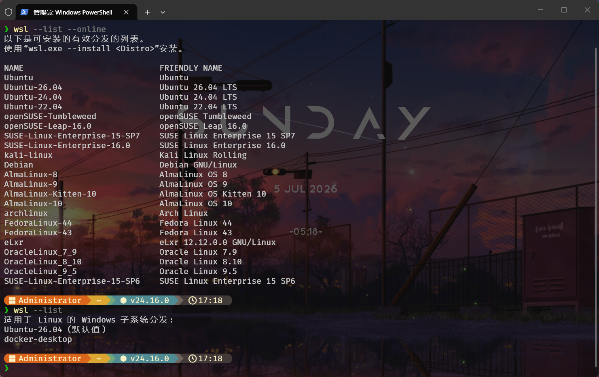

安裝完成後重新啟動電腦。

### 1.2 設定 WSL2 為預設版本

```powershell
wsl --set-default-version 2
```

### 1.3 驗證 WSL 版本

```powershell
wsl -l -v
```

輸出應顯示 Ubuntu 運行在 WSL 2。

---

## 二、安裝 Docker Desktop

### 2.1 下載 Docker Desktop

造訪 Docker 官方下載頁面：

> [Docker Desktop for Windows 下載地址](https://docs.docker.com/desktop/setup/install/windows-install/)

選擇 Windows amd64 版本下載安裝包。

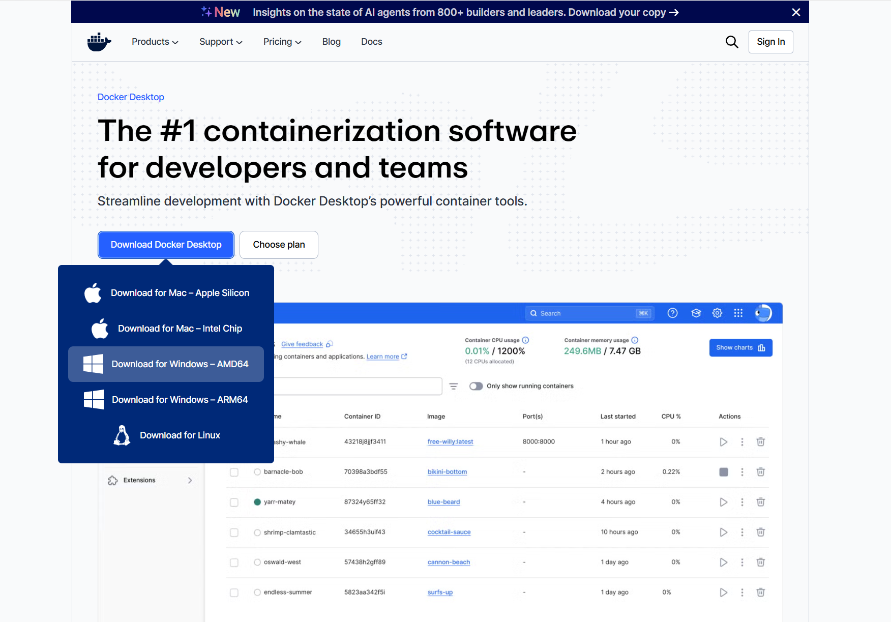

### 2.2 安裝與配置

安裝時勾選 **"Use WSL 2 instead of Hyper-V"** 選項。安裝完成後重新啟動電腦。

首次啟動時，Docker Desktop 會提示是否啟用 WSL 2 整合——選擇 **Yes**。

---

## 三、開啟 Docker 的 WSL 擴展

### 3.1 Docker Desktop 設定

開啟 Docker Desktop → Settings → Resources → WSL Integration：

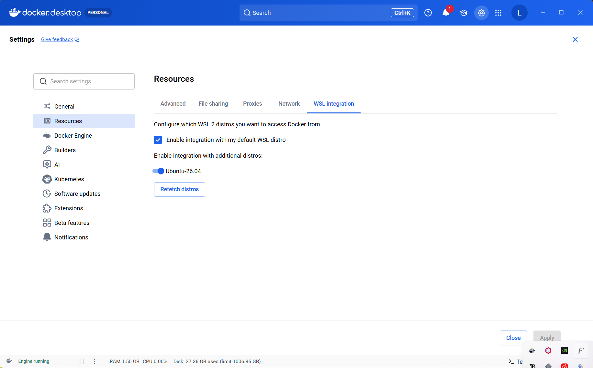

確保：

- **Enable integration with my default WSL distro** 已勾選
- Ubuntu 選項已啟用

這樣 Ubuntu 子系統內可以直接使用 `docker` 命令。

### 3.2 驗證 Docker 整合

進入 Ubuntu 終端：

```bash
docker --version
docker run hello-world
```

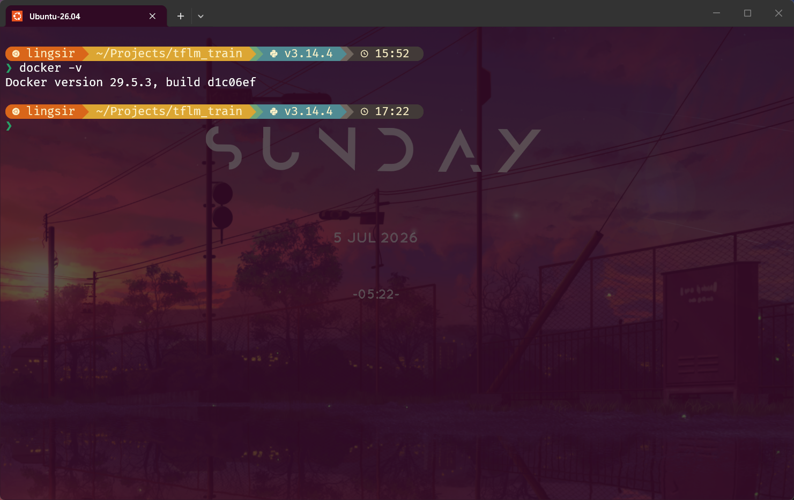

如果顯示 Docker 版本並成功拉取運行 hello-world 容器，說明整合完成。

---

## 四、拉取 NVIDIA TensorFlow 官方容器

### 4.1 容器地址

NVIDIA NGC 提供官方 TensorFlow 容器，預裝完整 GPU 加速環境：

> [NVIDIA TensorFlow 25.02-tf2-py3 容器地址](https://catalog.ngc.nvidia.com/orgs/nvidia/-/containers/tensorflow/25.02-tf2-py3)

### 4.2 拉取容器

在 Ubuntu 終端執行：

```bash
docker pull nvcr.io/nvidia/tensorflow:25.02-tf2-py3
```

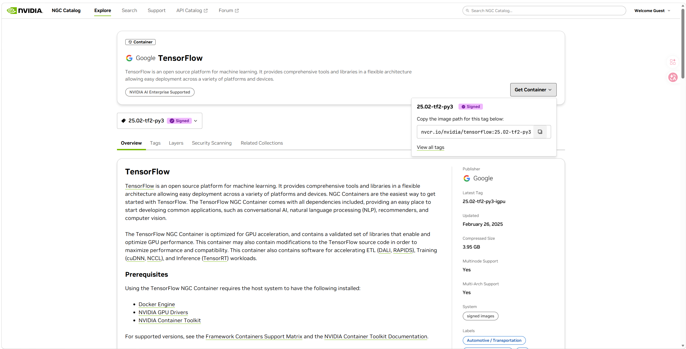

映像大小約 5GB，包含：

- TensorFlow 2.x
- CUDA 12.x
- cuDNN 9.x
- Python 3.x
- Jupyter Notebook
- TensorBoard

### 4.3 驗證容器安裝

```bash
docker images
```

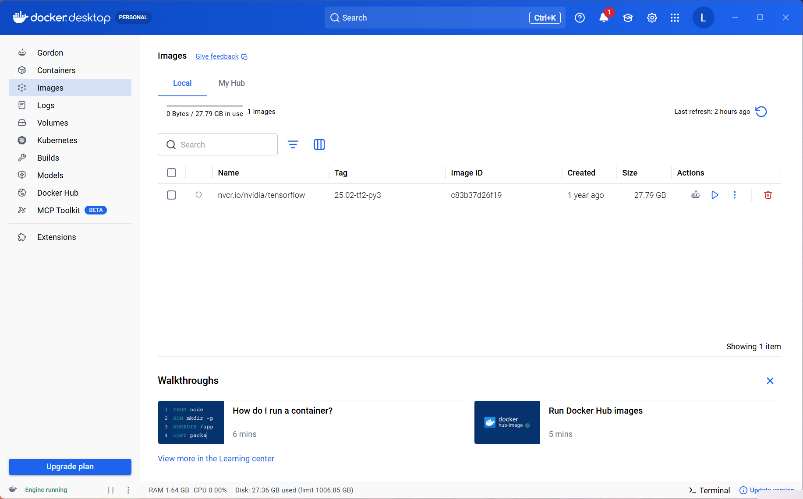

確認 `nvcr.io/nvidia/tensorflow` 映像已存在。

---

## 五、啟動 TensorFlow 容器

### 5.1 容器啟動命令

在專案目錄下執行（`${PWD}` 會掛載當前目錄到容器 `/workspace`）：

```bash
docker run --gpus all \
  --ipc=host \
  --ulimit memlock=-1 \
  --ulimit stack=67108864 \
  --rm \
  -it -p 8888:8888 \
  -p 6006:6006 \
  -v ${PWD}:/workspace \
  nvcr.io/nvidia/tensorflow:25.02-tf2-py3
```

參數解析：

| 參數                      | 作用                                       |
| ------------------------- | ------------------------------------------ |
| `--gpus all`              | 允許容器存取所有 GPU                       |
| `--ipc=host`              | 使用主機 IPC namespace，共享記憶體通訊更高效 |
| `--ulimit memlock=-1`     | 無限鎖定記憶體，適合大模型訓練               |
| `--ulimit stack=67108864` | 64MB 堆疊大小                                |
| `--rm`                    | 容器退出後自動刪除                         |
| `-it`                     | 互動模式 + 偽終端                          |
| `-p 8888:8888`            | Jupyter Notebook 連接埠映射                  |
| `-p 6006:6006`            | TensorBoard 連接埠映射                       |
| `-v ${PWD}:/workspace`    | 當前目錄掛載到容器工作空間                 |

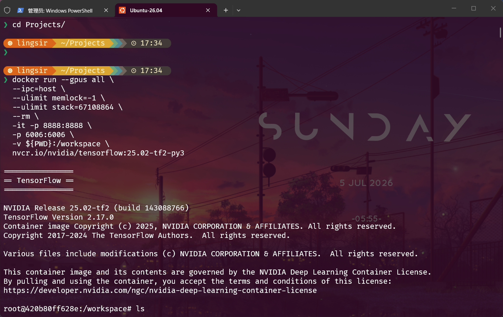

### 5.2 容器運行狀態

```bash
docker ps
```

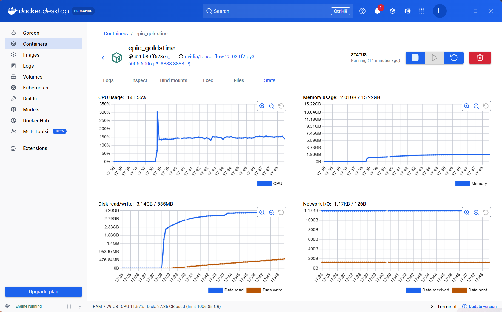

容器運行後，可以直接在容器內執行 Python 腳本。

---

## 六、準備訓練專案

### 6.1 專案目錄結構

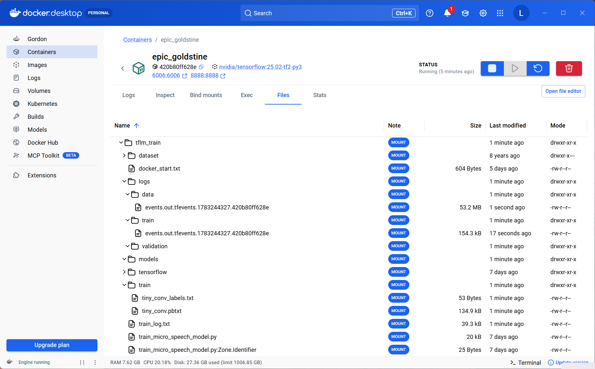

典型 TensorFlow Lite Micro 訓練專案結構：

```
/workspace/Projects/tflm_train/
├── train_micro_speech_model.py   # 訓練腳本
├── data/                          # 資料集目錄
├── logs/                          # TensorBoard 日誌
├── models/                        # 輸出模型
└── train_log.txt                  # 訓練日誌
```

### 6.2 資料集準備

關鍵詞檢測模型使用 Google Speech Commands 資料集，包含 30+ 關鍵詞的數千條語音樣本。

---

## 七、開始模型訓練

### 7.1 訓練命令

在容器內執行：

```bash
python3 train_micro_speech_model.py \
  --skip_clone --skip_download \
  --clean \
  --wanted_words=yes,no,up,down,left,right,on,off,stop,go \
  --model_architecture=tiny_conv \
  --training_steps=8000,10000,7000 \
  --learning_rate=0.001,0.0005,0.0001 \
  2>&1 | tee train_log.txt
```

參數解析：

| 參數                                  | 作用                                                 |
| ------------------------------------- | ---------------------------------------------------- |
| `--skip_clone --skip_download`        | 跳過倉庫克隆和資料下載（已準備好）                   |
| `--clean`                             | 清理舊的訓練輸出                                     |
| `--wanted_words`                      | 目標關鍵詞：yes/no/up/down/left/right/on/off/stop/go |
| `--model_architecture=tiny_conv`      | 使用 tiny_conv 架構（適合嵌入式）                    |
| `--training_steps=8000,10000,7000`    | 三階段訓練步數                                       |
| `--learning_rate=0.001,0.0005,0.0001` | 三階段學習率衰減                                     |
| `2>&1 \| tee train_log.txt`           | 輸出同時列印和寫入日誌                               |

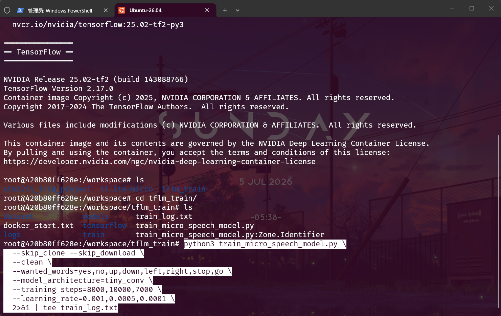

### 7.2 觀察訓練狀態

訓練過程中會列印：

```
Step 1000: loss=1.23, accuracy=0.78
Step 2000: loss=0.89, accuracy=0.85
...
```

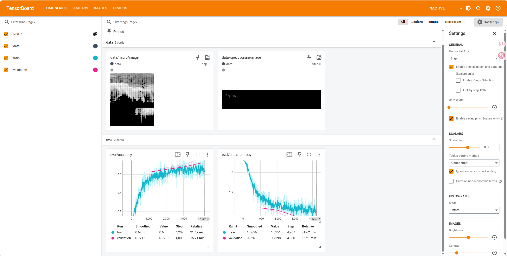

---

## 八、TensorBoard 視覺化訓練

### 8.1 啟動 TensorBoard

在容器內執行：

```bash
tensorboard --logdir=/workspace/Projects/tflm_train/logs --bind_all --port=6006
```

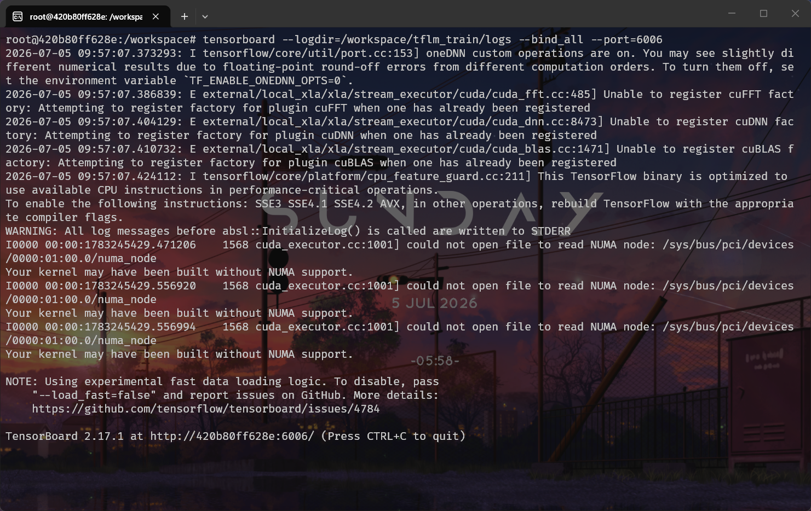

### 8.2 存取 TensorBoard

瀏覽器開啟：

> [http://localhost:6006](http://localhost:6006)

可以看到：

- **SCALARS**：loss、accuracy 曲線
- **IMAGES**：模型結構視覺化
- **GRAPHS**：計算圖拓撲
- **DISTRIBUTIONS**：權重分佈
- **HISTOGRAMS**：權重直方圖

---

## 九、訓練結果與模型量化

### 9.1 最終訓練結果

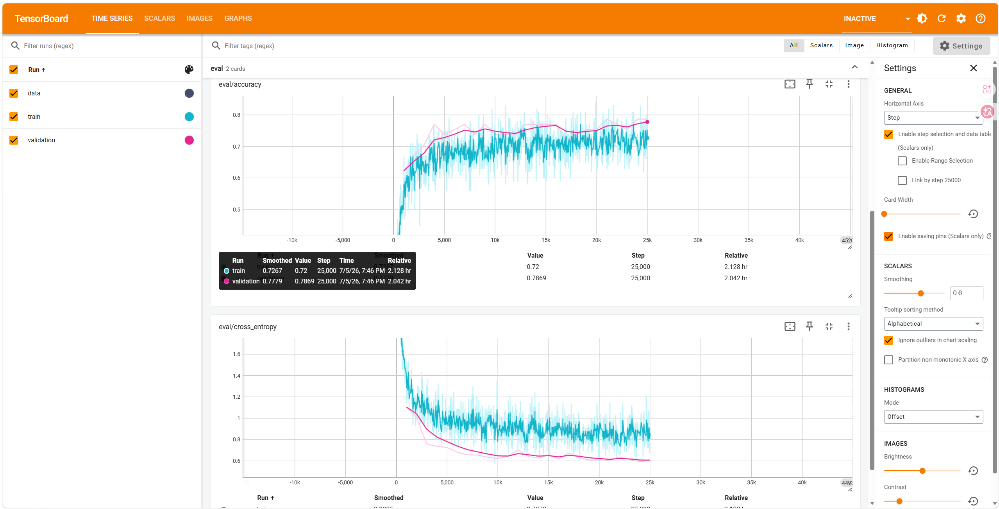

訓練完成後，輸出：

- `.tflite` 浮點模型（約 50KB）
- 訓練日誌 `train_log.txt`
- TensorBoard 日誌目錄

### 9.2 模型量化

TensorFlow Lite 支援 **訓練後量化**：

```bash
python3 quantize_model.py \
  --input_model=models/micro_speech.tflite \
  --output_model=models/micro_speech_quantized.tflite
```

量化後模型：

- 大小壓縮至約 **18KB**
- 精度損失約 1-2%
- 適合 MCU 運行

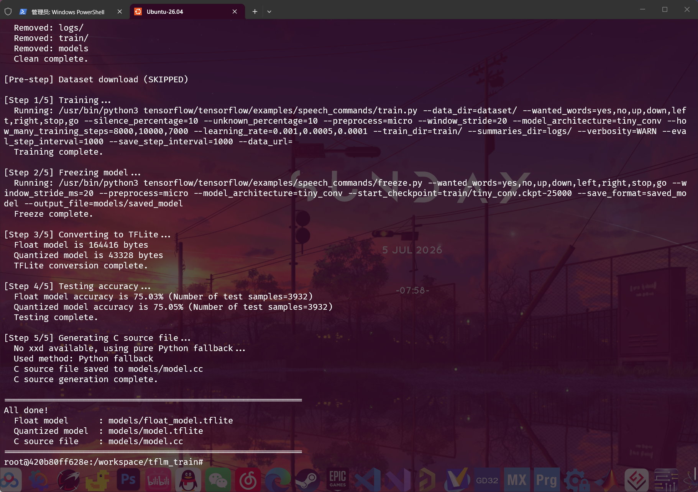

---

## 十、STM32F407 部署測試

### 10.1 模型整合

將量化後的 `.tflite` 模型轉換為 C 陣列：

```bash
xxd -i models/micro_speech_quantized.tflite > micro_speech_model_data.cc
```

### 10.2 STM32CubeAI 匯入

在 STM32CubeMX 中：

1. 新增 X-CUBE-AI 元件
2. 匯入 `.tflite` 模型
3. 產生程式碼

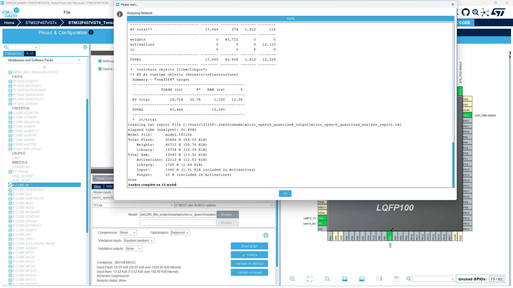

CubeMX 會自動解析模型結構並產生推論程式碼框架。

### 10.3 測試結果

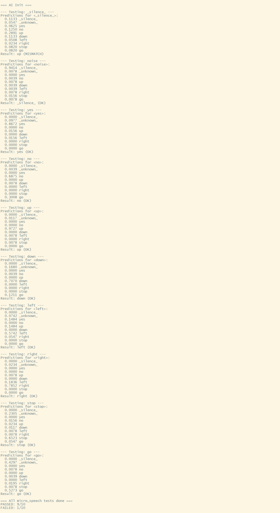

在 STM32F407VGT6 上運行關鍵詞檢測：

- **推論時間**：約 30ms（不含音訊預處理）
- **記憶體佔用**：約 50KB RAM
- **準確率**：實測 85%+

---

## 十一、環境清理與常見問題

### 11.1 容器清理

訓練完成後，容器會因 `--rm` 參數自動刪除。映像保留：

```bash
# 檢視映像
docker images

# 刪除映像（如不再需要）
docker rmi nvcr.io/nvidia/tensorflow:25.02-tf2-py3
```

### 11.2 常見問題

**Q: WSL2 無法識別 GPU？**

確保：

- Windows 已安裝 NVIDIA 驅動（最新版）
- Docker Desktop 的 WSL 整合已開啟
- 容器啟動時新增 `--gpus all`

**Q: TensorBoard 無法存取？**

檢查：

- 容器是否正確映射 `-p 6006:6006`
- TensorBoard 是否使用 `--bind_all`
- Windows 防火牆是否允許連接埠

**Q: 訓練速度很慢？**

排查：

- GPU 是否被正確識別（`nvidia-smi`）
- 資料集是否在容器內（避免跨掛載讀寫）
- `--ipc=host` 參數是否新增

---

## 參考資料

- [WSL2 官方文件](https://docs.microsoft.com/en-us/windows/wsl/)
- [Docker Desktop for Windows](https://docs.docker.com/desktop/setup/install/windows-install/)
- [NVIDIA TensorFlow 容器](https://catalog.ngc.nvidia.com/orgs/nvidia/-/containers/tensorflow/25.02-tf2-py3)
- [TensorFlow Lite Micro](https://www.tensorflow.org/lite/microcontrollers)
- [STM32CubeAI](https://www.st.com/en/embedded-software/x-cube-ai.html)
